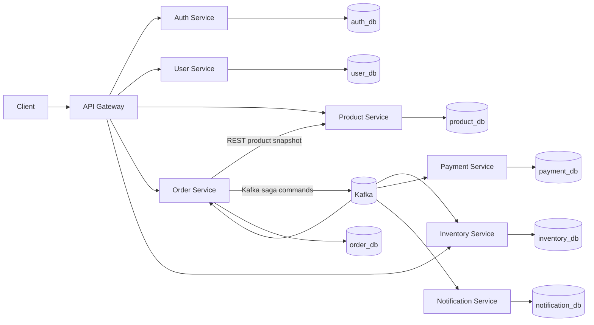

# E-Commerce Microservices Platform

A production-style Java 21 and Spring Boot 3 e-commerce system built incrementally as both a runnable distributed application and a practical microservices course.

> **Implementation status:** foundation phase. Product Service currently has a verified runnable scaffold. Architecture documents describe accepted target decisions; unimplemented capabilities are explicitly marked as planned.

## Project Overview

The completed platform will support this business journey:

```text
Register -> Login -> Browse products -> Check inventory -> Create order
         -> Reserve inventory -> Process payment -> Confirm or cancel
         -> Send notification
```

The project emphasizes the engineering problems behind that journey: data ownership, concurrency, partial failure, distributed transactions, idempotency, security, resilience, observability, testing, and operability.

## Why Microservices?

The service boundaries have different invariants and operational profiles. Catalog traffic is read-heavy, inventory reservation is concurrency-sensitive, authentication protects credentials, payment has its own idempotency rules, and notification delivery must not block order completion.

Microservices let those capabilities own their data and evolve independently. They also introduce network failure, eventual consistency, contract evolution, and operational cost. This repository makes those costs visible instead of presenting microservices as a collection of CRUD projects.

See [Monolith vs Microservices](docs/learning/01-monolith-vs-microservices.md) for the full comparison.

## Architecture



The complete design and current-state warning are maintained in [System Overview](docs/architecture/system-overview.md).

## Services

| Service | Responsibility | Status |
| --- | --- | --- |
| API Gateway | Public routing, correlation IDs, edge security | Planned |
| Auth Service | Credentials, password hashing, JWT and roles | Planned |
| User Service | Customer profiles and addresses | Planned |
| Product Service | Catalog, current prices, filtering and management | Scaffolded |
| Inventory Service | Stock, reservations, releases and concurrency | Planned |
| Order Service | Orders, immutable item snapshots and saga orchestration | Planned |
| Payment Service | Idempotent simulated payments and compensation | Planned |
| Notification Service | Asynchronous notification history and delivery simulation | Planned |

Detailed ownership and prohibited coupling are documented in [Service Boundaries](docs/architecture/service-boundaries.md).

## Technology Stack

| Technology | Why it is used | Status |
| --- | --- | --- |
| Java 21 | LTS runtime, records, modern language/runtime features | Active |
| Spring Boot 3.5 | Production application foundation and dependency management | Active |
| Maven Wrapper | Reproducible builds without global Maven installation | Active |
| PostgreSQL | Strong relational constraints and transactional service data | Planned |
| Flyway | Versioned, reviewable service-owned schema migrations | Planned |
| Spring Security and JWT | Authentication and decentralized token validation | Planned |
| Spring Cloud Gateway | Reactive edge routing without business logic | Planned |
| Kafka | Durable asynchronous saga communication and notifications | Planned |
| Testcontainers | Integration tests against real PostgreSQL/Kafka behavior | Planned |
| Resilience4j | Bounded failure handling for justified synchronous calls | Planned |
| Micrometer/OpenTelemetry | Metrics and distributed traces | Planned |
| Docker Compose | Reproducible complete local environment | Planned |

Redis and Kubernetes are deliberately deferred until a concrete need exists and Docker Compose works end to end.

## Repository Structure

Current:

```text
.
├── product-service/            # Initial scaffold; moves under services/ next
├── docs/
│   ├── architecture/
│   ├── decisions/
│   └── learning/
└── README.md
```

Accepted target:

```text
.
├── services/
│   ├── api-gateway/
│   ├── auth-service/
│   ├── user-service/
│   ├── product-service/
│   ├── inventory-service/
│   ├── order-service/
│   ├── payment-service/
│   └── notification-service/
├── contracts/                  # Versioned HTTP/event schemas, not shared entities
├── infrastructure/
│   ├── database/
│   ├── kafka/
│   └── monitoring/
├── docs/
│   ├── architecture/
│   ├── decisions/
│   ├── flows/
│   └── learning/
├── pom.xml                     # Build aggregation only
├── compose.yaml
└── .env.example
```

The rationale is recorded in [ADR 001](docs/decisions/001-monorepo.md).

## Database Architecture

Every persistent service exclusively owns one logical database and credentials. No service may query another service's tables or share JPA entities. Local development may co-locate logical databases on one PostgreSQL server to save resources; ownership remains isolated.

See [Database Architecture](docs/architecture/database-architecture.md) and [ADR 002](docs/decisions/002-database-per-service.md).

## Authentication

Planned flow:

1. Auth Service registers credentials and hashes passwords.
2. Login returns a short-lived JWT access token with subject and roles.
3. Gateway validates the token for edge routing decisions.
4. Backend resource services validate the token and enforce their own authorization.
5. User Service owns profile data; it never stores passwords.

Signing secrets or private keys will come from environment/runtime secret management and will never be committed.

## Communication

Synchronous HTTP is reserved for immediate answers. The primary example is Order requesting trusted product status and price snapshots before accepting an order. Kafka handles durable saga steps and notifications where eventual consistency is acceptable.

Internal service calls bypass Gateway. Every network dependency must define timeouts, availability behavior, retry safety, and correlation-ID propagation. See [Communication](docs/architecture/communication.md).

## Kafka

Kafka will carry versioned commands and events such as:

```text
InventoryReservationRequested
InventoryReserved | InventoryReservationFailed
PaymentRequested
PaymentCompleted | PaymentFailed
InventoryReleaseRequested
OrderConfirmed | OrderCancelled
NotificationRequested
```

Messages will include event identity, version, timestamp, aggregate ID, and correlation ID. Producers that update state and publish will use a transactional outbox. Consumers will assume at-least-once delivery and enforce idempotency.

## Order Workflow

The order endpoint will validate products synchronously, save a `PENDING` order with immutable item snapshots, and return `202 Accepted`. Inventory and payment then advance the order asynchronously. Clients query the order resource to observe the final outcome.

## Saga

Order Service will orchestrate the saga because it owns the customer-visible lifecycle and state machine. Inventory failure cancels the order. Payment failure after reservation requests an inventory release and then cancels the order. Notification reacts only after a durable business outcome.

The decision and trade-offs are in [ADR 003](docs/decisions/003-orchestrated-order-saga.md). Detailed flow documentation will be added with the implementation.

## Reliability

The target design uses:

- Explicit connection and response timeouts
- Bounded retries only for transient idempotent operations
- Circuit breakers for justified synchronous dependencies
- Transactional outbox for state-plus-message consistency
- Processed-event uniqueness for consumer idempotency
- Validated order state transitions
- Compensation rather than cross-service rollback

These mechanisms will not be added before their failure scenario exists in code.

## Observability

Every inbound request will receive or preserve a correlation ID. It will propagate through HTTP, Kafka metadata, and logs. Actuator health, Micrometer metrics, and OpenTelemetry-compatible tracing will be introduced after the connected workflow exists so the signals describe real behavior.

Sensitive values such as passwords, raw tokens, private keys, and payment details must never be logged.

## Running Locally

### Current Product Service scaffold

Requirements:

- Java 21
- PowerShell, Command Prompt, or a Unix-compatible shell

Run tests on Windows:

```powershell
cd product-service
.\mvnw.cmd test
```

Run the service:

```powershell
cd product-service
.\mvnw.cmd spring-boot:run
```

Verify health:

```powershell
Invoke-RestMethod http://localhost:8083/actuator/health
```

Expected response:

```json
{"status":"UP"}
```

The final target command will be:

```text
docker compose up --build
```

It is not documented as working until end-to-end validation passes.

## Configuration

The Product scaffold supports:

| Variable | Purpose | Default |
| --- | --- | --- |
| `SERVER_PORT` | Product Service HTTP port | `8083` |

Database, Kafka, JWT, and observability variables will be added to `.env.example` with their implementations. A real `.env` file is ignored and never committed.

## API Examples

Only the Actuator endpoint exists today:

```http
GET /actuator/health
```

Product, authentication, inventory, and order examples will be added only when their endpoints are executable.

## Testing

Current test suite:

```powershell
cd product-service
.\mvnw.cmd test
```

Each service will add the smallest meaningful combination of unit, controller, repository, integration, and Testcontainers tests. Coverage percentage is not the goal; behavior, edge cases, migrations, queries, concurrency, security, idempotency, and compensation are.

## Documentation

- [System overview](docs/architecture/system-overview.md)
- [Service boundaries](docs/architecture/service-boundaries.md)
- [Database architecture](docs/architecture/database-architecture.md)
- [Communication policy](docs/architecture/communication.md)
- [Architecture decisions](docs/decisions/)
- [Learning notes](docs/learning/)

Documentation is changed in the same milestone as the behavior it describes.

## Learning Guide

Start with:

1. [Monolith vs Microservices](docs/learning/01-monolith-vs-microservices.md)
2. [Service Boundaries](docs/learning/02-service-boundaries.md)
3. [Database per Service](docs/learning/03-database-per-service.md)
4. Read the three ADRs and compare their alternatives.
5. Inspect `product-service/pom.xml`, its application entry point, configuration, and context test.

Later notes will reference the exact service, class, endpoint, migration, event, and configuration that implements each concept.

## Engineering Workflow

- `main` remains stable.
- Significant work uses focused feature branches when isolation is useful.
- Logical milestones use Conventional Commits.
- Relevant builds/tests, diff review, secret scan, and self-review are required before push.
- No force pushes or rewritten published history.
- Simplicity and justified decisions matter more than the number of technologies.
