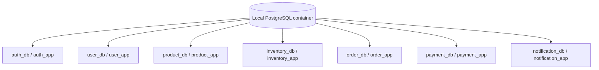

# Database Architecture

Status: **Accepted and implemented for all seven persistent services.**

## Database-per-service

Each persistent service has exclusive ownership of one logical database:

| Service | Database |
| --- | --- |
| Auth | `auth_db` |
| User | `user_db` |
| Product | `product_db` |
| Inventory | `inventory_db` |
| Order | `order_db` |
| Payment | `payment_db` |
| Notification | `notification_db` |

The API Gateway is stateless and has no business database.

## Ownership rules

- A database credential grants access only to its owning database.
- Flyway migrations live inside the owning service.
- Hibernate validates the migrated schema; it does not create or update production schemas.
- Foreign keys and JPA relationships exist only inside one service boundary.
- Cross-service references store opaque IDs without database constraints.
- Services exchange data only through APIs and versioned events.

## Local development

One PostgreSQL container hosts the logical databases in `compose.yaml` to reduce local resource usage. Separate databases and users still prevent accidental joins and direct access. `infrastructure/postgres/init-databases.sh` revokes public connection access and grants each login access to its owned database. This is operational co-location, not shared ownership.

`scripts/bootstrap-local-env.ps1` replaces the `.env.example` placeholders with cryptographically random local credentials in ignored `.env`, then Compose supplies them through environment variables. Real credentials and `.env` files must never be committed.

## Production evolution

Production may use one managed PostgreSQL cluster initially, with separate databases/users, then move high-load or sensitive services to separate instances. Because data ownership is already exclusive, physical migration does not require changing domain boundaries.

## Transactions

`@Transactional` protects only changes made through one service's database connection. It cannot cover Kafka publication or another service's database. Services that must atomically save state and request asynchronous work will use a transactional outbox. Consumers will use an inbox/processed-event constraint where duplicate delivery could repeat a side effect.

## Schema review checklist

Every migration must review primary keys, not-null and unique constraints, same-service foreign keys, indexes supporting real queries, timestamps, status representation, concurrency controls, and retention needs.
