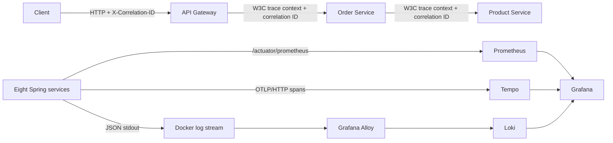

# Observability Architecture

## Goal

Observability lets an operator ask three different questions without attaching a debugger:

- **Metrics:** Is the platform healthy, and which service is becoming slow or error-prone?
- **Traces:** Which synchronous hop made one request slow or fail?
- **Logs:** What domain decision or exception occurred inside that hop?

The local stack uses the same open protocols that a hosted production platform can ingest. The storage choices are intentionally single-node and local-development oriented.

## Components and responsibilities

| Component | Responsibility | Data source |
| --- | --- | --- |
| Spring Boot Actuator + Micrometer | Publish health and low-cardinality runtime/HTTP/JVM metrics | All eight applications |
| OpenTelemetry exporter | Send sampled spans over OTLP/HTTP | All eight applications |
| Prometheus | Scrape and query metrics | `/actuator/prometheus` |
| Tempo | Store and search distributed traces | OTLP spans |
| Spring structured logging | Emit machine-readable Logstash JSON | Application stdout |
| Grafana Alloy | Discover labelled application containers and ship stdout | Docker socket |
| Loki | Store and query centralized logs | Alloy |
| Grafana | Correlate dashboards, traces, and logs | Prometheus, Tempo, Loki |

## Runtime flow



The synchronous create-order trace contains Gateway, Order, and Product spans. The durable saga deliberately crosses transaction and scheduling boundaries through outbox rows and Kafka. Its event envelope carries the correlation ID from beginning to end; a single long parent-child trace is not fabricated for work that may resume much later or in another process. Kafka producer/consumer observations still create transport and processing spans, while the correlation ID joins the complete business journey in logs and persisted event metadata.

## Cardinality and security rules

- `application`, route, method, status, and exception type are suitable metric dimensions.
- User IDs, order IDs, product IDs, correlation IDs, and trace IDs must not be metric labels or Loki stream labels; their unbounded values would create cardinality growth.
- Trace and correlation IDs remain JSON log fields, so operators can filter them at query time.
- Passwords, bearer/refresh tokens, private keys, database passwords, and payment details must never be logged.
- Only health, info, and Prometheus endpoints are unauthenticated. Other actuator endpoints remain unexposed.
- Compose binds observability ports to loopback. Production requires authenticated ingress/network policy and externally managed credentials.

## Sampling and retention

Plain JVM execution defaults to tracing disabled so tests and local single-service work do not depend on Tempo. Compose enables OTLP export and defaults to `100%` sampling because it is a bounded learning environment. Production should choose head or tail sampling from measured traffic, error-debugging needs, and cost rather than retaining every successful request.

Tempo and Loki use local filesystem storage with 24-hour retention. Prometheus keeps its local time-series database in a named volume. These settings are convenient for one developer machine, not a high-availability production design.

## Operations

Start and verify the stack:

```powershell
Copy-Item .env.example .env
docker compose up --build -d
.\scripts\verify-observability.ps1
.\scripts\verify-compose.ps1
```

Local endpoints:

| Tool | URL |
| --- | --- |
| Grafana | `http://localhost:3000` |
| Prometheus | `http://localhost:9090` |
| Tempo readiness/API | `http://localhost:3200` |
| Loki readiness/API | `http://localhost:3100` |
| Alloy UI | `http://localhost:12345` |

Grafana provisions the three data sources and the **E-Commerce Service Overview** dashboard automatically. Local credentials come from `.env`; `.env.example` contains development-only placeholders.

## Failure interpretation

- A service may report ready while one later request fails. Readiness is not a replacement for timeouts, retries, or circuit breakers.
- Missing metrics usually means the scrape target is down, the Prometheus endpoint is protected, or networking is wrong.
- Missing traces with healthy requests may be expected under sampling; inspect exporter health and the configured probability before declaring data loss.
- Missing logs can originate at Docker discovery, Alloy processing, or Loki ingestion. Alloy only collects containers labelled `observability.logs=true`.
- Trace-to-log links require the JSON `traceId` field. Business-flow searches across asynchronous saga steps should use `correlationId`.

