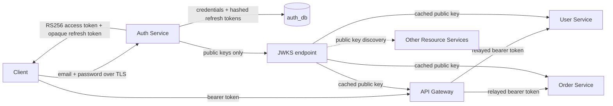

# Security Architecture

## Current Scope

Auth Service implements credential storage, BCrypt, RS256 access tokens, rotating opaque refresh tokens, public JWKS, and CUSTOMER/ADMIN claims. API Gateway accepts only RS256, validates issuer/signature/expiry through JWKS, applies coarse route roles, strips untrusted identity headers, and relays the bearer token. User and Order Services validate the token again, require CUSTOMER/ADMIN, and scope their resources to JWT `sub`. Product, Inventory, and later services add backend enforcement in their own milestones; Product and Inventory management endpoints are protected at the edge but are not yet safe for direct public exposure.

## Trust Boundaries

The private signing key stays inside Auth. Verifiers need only public keys, so compromise of a gateway/backend verification configuration cannot mint tokens. A shared HMAC secret would give every verifier signing power and enlarge the compromise blast radius.

## Authentication and Authorization

Authentication answers “who is this?” Auth proves credentials once and issues a signed identity. Authorization answers “may this identity do this?” Gateway/backend services interpret roles and ownership for each endpoint. A valid token is not automatic permission for every operation.

Defense in depth means the gateway performs coarse edge checks while services enforce business ownership/role rules. Internal network location is not treated as authentication.

## Token Validation

Every verifier must validate:

- RS256 signature against the key identified by `kid`;
- trusted issuer exactly;
- expiry/not-before timestamps with small deliberate clock skew;
- required claim types;
- endpoint roles and resource ownership.

JWT validation is local and avoids an Auth network call on every request. The trade-off is revocation latency: a stolen access token normally remains valid until its short expiry. Refresh tokens are stateful and revocable.

## Key Lifecycle

Local ephemeral keys optimize safe developer startup without repository secrets. Production requires externally managed keys. Rotation should publish both old and new public keys during the overlap, sign new tokens with a new `kid`, wait beyond maximum access-token TTL, then remove the old public key.

## Sensitive Data and Logging

Never log raw passwords, password hashes, access tokens, refresh tokens, private keys, or full Authorization headers. Auth logs account UUIDs and correlation IDs for operational diagnosis. API errors are sanitized and contain no stack traces.

## Remaining Security Work

- Resource-server validation and method/ownership checks in Product, Inventory, Payment, and Notification where applicable.
- CORS policy and TLS termination for deployed environments.
- Rate limiting/credential-stuffing defense at the edge.
- Production secret/key rotation procedures.
- Security event audit/alerting and refresh-token retention cleanup.
