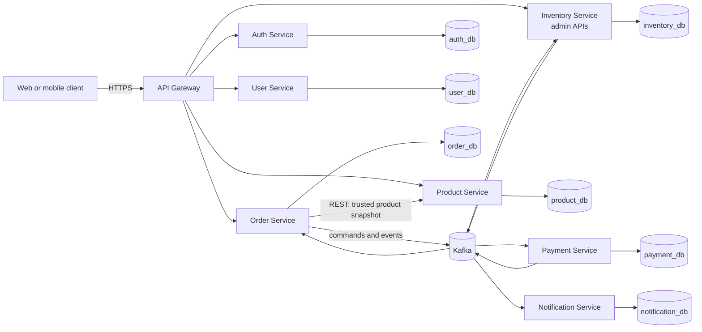
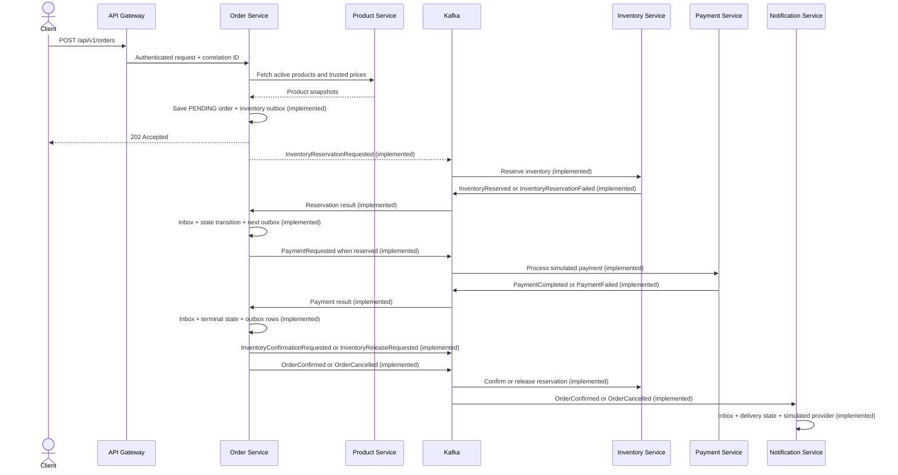

# System Overview

Status: **Accepted target architecture; implementation is incremental.**

## Business goal

The platform supports a customer journey from registration and login through product browsing, inventory reservation, simulated payment, order confirmation or cancellation, and notification. The system is designed as one connected distributed workflow rather than unrelated CRUD applications.

## Current state

API Gateway, Auth, User, Product, Inventory, Order orchestration, Payment, and Notification are implemented, containerized, tested, documented, and connected by Docker Compose. Gateway routes Order traffic and applies coarse roles; Order validates Auth JWTs again, scopes data to `sub`, obtains trusted Product snapshots through one bounded batch call, and commits the order plus its first saga command only to `order_db`. Inventory consumes reservation and status commands idempotently from `inventory_db`. Order records Inventory outcomes in its inbox: success atomically moves the order to `PAYMENT_PENDING` and creates `PaymentRequested`; reservation failure cancels it. Payment calls its idempotent provider port outside a database transaction, then atomically commits the terminal payment state, inbox, and `PaymentCompleted` or `PaymentFailed` outbox in `payment_db`. Order consumes that outcome: success confirms the order and requests inventory confirmation, while failure cancels the order and requests inventory release. Notification consumes the resulting `OrderConfirmed` or `OrderCancelled`, stores an idempotent delivery record in `notification_db`, and simulates delivery without blocking Order. All four Kafka-consuming services classify deterministic poison messages separately from transient failures, use bounded exponential retry, require acknowledged DLT publication, and expose failure/recovery metrics plus exact-record replay tooling. Prometheus metrics, OpenTelemetry traces through Tempo, JSON logs through Alloy/Loki, and a provisioned Grafana dashboard cover all eight applications. Product and Inventory management APIs still need their own resource-server enforcement before direct exposure is safe. Registration-to-profile auto-provisioning remains pending. A component is not considered implemented until its code, tests, runtime configuration, and documentation are present.

## Target architecture



## Architectural rules

1. The API Gateway is the public entry point and contains no core business rules.
2. Each stateful service exclusively owns its database and local transactions.
3. No cross-service foreign keys, JPA relationships, repository calls, or database queries are allowed.
4. Synchronous REST is used only when the caller needs an immediate answer.
5. Kafka is used for long-running workflows and decoupled reactions where eventual consistency is acceptable.
6. Order Service orchestrates the order saga and owns its state machine.
7. Events are versioned contracts, not serialized JPA entities.
8. Event consumers assume at-least-once delivery and implement idempotency.
9. Correlation IDs cross HTTP, events, and logs.
10. Optional infrastructure is added only after a demonstrated need.
11. Metric and log labels use bounded dimensions; trace and correlation identifiers remain query fields.

## Main flows

### Product browsing

```text
Client -> Gateway -> Product Service -> product_db
```

This flow is synchronous because the client needs an immediate catalog response.

### Order creation



Synchronous acceptance through `202`, the asynchronous saga through a terminal Order state, and the decoupled Notification reaction are implemented. A local `@Transactional` method cannot atomically update Order, Inventory, Payment, and Notification databases; each participant uses local transactions plus outbox/inbox records. Payment failure is compensated by a new durable inventory-release command rather than a cross-database rollback.

## Deployment view

Local development uses Docker Compose, one container per application, Kafka, a PostgreSQL server hosting separate logical databases and users, and a single-node observability stack. Compose DNS supplies internal addresses; only loopback host ports are published for local access. Production deployment may isolate databases physically and replace local observability storage without changing application protocols or service ownership.

Kubernetes is intentionally deferred until the complete Docker Compose environment works and has passing end-to-end validation.
