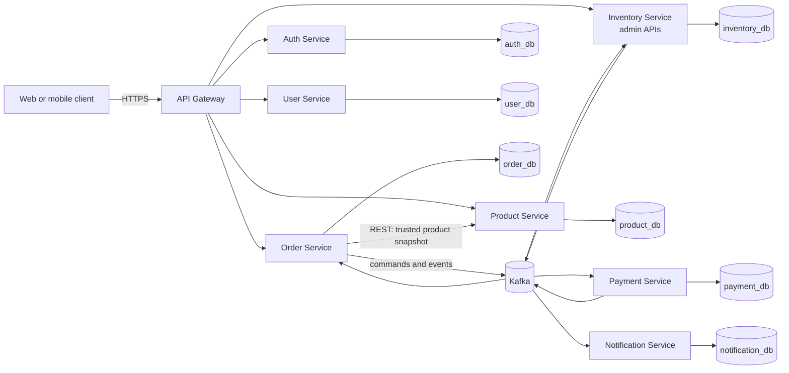

# System Overview

Status: **Accepted target architecture; implementation is incremental.**

## Business goal

The platform supports a customer journey from registration and login through product browsing, inventory reservation, simulated payment, order confirmation or cancellation, and notification. The system is designed as one connected distributed workflow rather than unrelated CRUD applications.

## Current state

API Gateway, Auth, User, Product, Inventory, Order acceptance, and Payment's core application workflow are implemented, containerized, tested, and documented. Gateway routes Order traffic and applies coarse roles; Order validates Auth JWTs again, scopes data to `sub`, obtains trusted Product snapshots through one bounded batch call, and commits the order plus its first saga command only to `order_db`. Its outbox publishes `InventoryReservationRequested`. Inventory consumes that command idempotently in `inventory_db` and publishes `InventoryReserved` or `InventoryReservationFailed` from its own outbox. Payment independently owns `payment_db`, idempotent charge/refund state, and a simulated processor adapter. New orders remain `PENDING` because Order outcome handling and the Payment Kafka adapter are not implemented yet. Product and Inventory management APIs still need their own resource-server enforcement before direct exposure is safe. Registration-to-profile auto-provisioning is also pending. A component is not considered implemented until its code, tests, runtime configuration, and documentation are present.

## Target architecture



## Architectural rules

1. The API Gateway is the public entry point and contains no core business rules.
2. Each stateful service exclusively owns its database and local transactions.
3. No cross-service foreign keys, JPA relationships, repository calls, or database queries are allowed.
4. Synchronous REST is used only when the caller needs an immediate answer.
5. Kafka is used for long-running workflows and decoupled reactions where eventual consistency is acceptable.
6. Order Service orchestrates the order saga and owns its state machine.
7. Events are versioned contracts, not serialized JPA entities.
8. Event consumers assume at-least-once delivery and implement idempotency.
9. Correlation IDs cross HTTP, events, and logs.
10. Optional infrastructure is added only after a demonstrated need.

## Main flows

### Product browsing

```text
Client -> Gateway -> Product Service -> product_db
```

This flow is synchronous because the client needs an immediate catalog response.

### Order creation

```mermaid
sequenceDiagram
    actor Client
    participant G as API Gateway
    participant O as Order Service
    participant P as Product Service
    participant K as Kafka
    participant I as Inventory Service
    participant Pay as Payment Service
    participant N as Notification Service

    Client->>G: POST /api/v1/orders
    G->>O: Authenticated request + correlation ID
    O->>P: Fetch active products and trusted prices
    P-->>O: Product snapshots
    O->>O: Save PENDING order + inventory outbox (implemented)
    O-->>Client: 202 Accepted
    O-->>K: InventoryReservationRequested (implemented)
    K->>I: Reserve inventory (implemented)
    I->>K: InventoryReserved or InventoryReservationFailed (implemented)
    K->>O: Reservation result (adapter pending)
    O->>K: PaymentRequested when reserved
    K->>Pay: Process simulated payment (adapter pending; core ready)
    Pay->>K: PaymentCompleted or PaymentFailed (pending)
    K->>O: Payment result
    O->>K: OrderConfirmed or compensation commands
    K->>N: Customer notification event
```

Synchronous acceptance through `202`, the durable Order-to-Inventory Kafka step, and Payment's local idempotent workflow are implemented. Order outcome handling and subsequent saga steps remain pending. A local `@Transactional` method cannot atomically update Order, Inventory, and Payment databases; each implemented participant uses a local transaction plus outbox/inbox records.

## Deployment view

Local development will use Docker Compose, one container per application, Kafka, and a PostgreSQL server hosting separate logical databases and users. Production deployment may isolate databases physically without changing service ownership.

Kubernetes is intentionally deferred until the complete Docker Compose environment works and has passing end-to-end validation.
