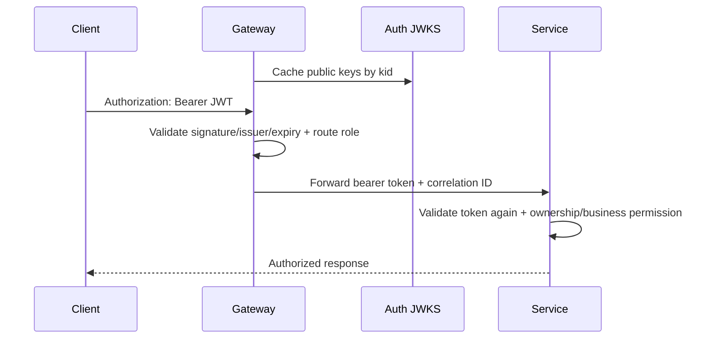

# Authentication Flow

## Register and Login

```mermaid
sequenceDiagram
    autonumber
    participant Client
    participant Auth as Auth Service
    participant DB as auth_db

    Client->>Auth: POST /register (email, password)
    Auth->>Auth: Normalize email; BCrypt cost 12
    Auth->>DB: Insert account + CUSTOMER role
    Auth->>DB: Insert SHA-256(refresh token)
    Auth-->>Client: 201 RS256 access token + raw refresh token

    Client->>Auth: POST /login
    Auth->>DB: Fetch account + roles
    Auth->>Auth: BCrypt verify (or dummy verify if unknown)
    Auth->>DB: Insert hashed refresh token
    Auth-->>Client: 200 new token pair
```

Auth never sends password data to User Service. Profile provisioning is a separate cross-service consistency step to be connected later.

## Refresh Rotation

```mermaid
sequenceDiagram
    autonumber
    participant Client
    participant Auth as Auth Service
    participant DB as auth_db

    Client->>Auth: POST /refresh (opaque token R1)
    Auth->>Auth: SHA-256(R1)
    Auth->>DB: Find token + account + roles
    Auth->>Auth: Check active, unexpired, unrevoked
    Auth->>DB: Revoke R1; insert hash(R2) in one transaction
    Auth-->>Client: Access token A2 + raw R2
    Client->>Auth: Retry R1
    Auth-->>Client: 401 INVALID_REFRESH_TOKEN
```

Rotation is one local database transaction. If it rolls back, R1 remains usable and no R2 is returned. If the HTTP response is lost after commit, R1 is revoked and the client must re-authenticate; token-family recovery is a possible future enhancement.

## Request Authentication (Target Connected Flow)



This final flow is documentation of the selected contract; it becomes current only when Gateway and resource services implement it.
