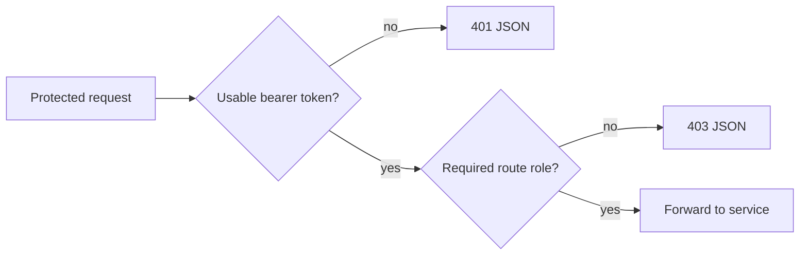

# API Gateway Request Flow

## Protected User Request

```mermaid
sequenceDiagram
    autonumber
    actor Client
    participant G as API Gateway
    participant J as Auth JWKS
    participant U as User Service
    participant D as user_db

    Client->>G: PUT /api/v1/users/me + Bearer JWT + correlation ID
    G->>G: Normalize correlation ID; remove spoofed identity headers
    G->>J: Fetch/cache public key by kid when needed
    G->>G: Verify RS256, issuer, expiry, CUSTOMER/ADMIN
    G->>U: Relay request + original bearer token + correlation ID
    U->>J: Fetch/cache public key when needed
    U->>U: Verify token again; derive user UUID from sub
    U->>D: Commit profile in a local transaction
    U-->>G: Profile + correlation ID
    G->>G: Normalize to one response correlation header
    G-->>Client: 200 profile
```

Gateway and User may cache JWKS independently. A cached public key avoids a call to Auth on every request, while explicit lookup timeouts bound cache-miss/key-rotation failure. Compose therefore mounts the same generated signing configuration into every replacement Auth container: a routine restart keeps the same `kid` and key, so already issued tokens remain verifiable. Production rotation requires publishing old and new keys concurrently for at least the access-token lifetime plus verifier-cache allowance.

## Public Product Read

```text
Client -> Gateway: GET /api/v1/products/{id}
Gateway -> Product: same path + correlation ID
Product -> product_db: local read
Product -> Gateway -> Client: response
```

Product reads are public at the edge. Product mutations require `ADMIN`. Product Service will gain its own resource-server authorization in a later security milestone; until then, its management API should not be exposed directly outside the controlled local network.

## Protected Order Request

```text
Client -> Gateway: POST /api/v1/orders + JWT + Idempotency-Key
Gateway: verify CUSTOMER/ADMIN; relay JWT and correlation ID
Gateway -> Order: same request
Order: verify JWT again; derive customer UUID from sub
Order -> Product: direct internal batch lookup (Gateway is bypassed)
Order -> order_db: commit PENDING order and immutable snapshots
Order -> Gateway -> Client: 202 Accepted
```

Gateway does not retry this POST and does not decide product validity, idempotency conflicts, ownership, totals, or order state. Those rules stay in Order Service. The detailed dependency/failure flow is documented in [Order Creation Flow](order-creation-flow.md).

## Rejection Before Routing



A 401 means authentication is missing or invalid. A 403 means the principal is authenticated but lacks the coarse route role. A backend may still return another 403/404 after applying ownership or domain policy.

## Failure Boundaries

- If Gateway is unavailable, public client traffic cannot enter even when a backend is healthy.
- If a backend cannot be reached within the configured bounds, Gateway fails that request instead of waiting indefinitely.
- If Auth/JWKS is unavailable on a key-cache miss, a protected request cannot be safely authenticated.
- Retrying writes at the gateway is unsafe by default because the downstream may have committed before the response was lost.
- Calling a backend directly must not bypass its own authentication and authorization.
