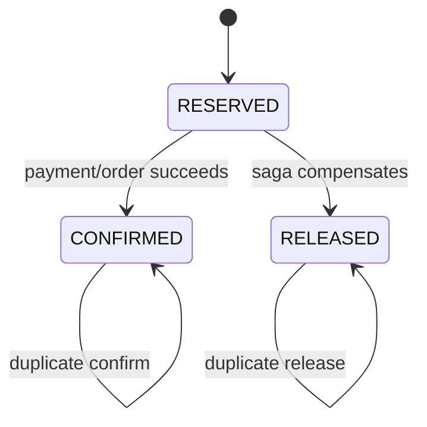

# Inventory Reservation Flow

## Reserve All or Nothing

```mermaid
sequenceDiagram
    autonumber
    participant Caller
    participant API as InventoryController
    participant App as InventoryService
    participant DB as inventory_db

    Caller->>API: POST /api/v1/inventory/reservations
    API->>API: Validate orderId and unique positive lines
    API->>App: reserve(request)
    App->>DB: Find reservation by unique orderId
    alt Identical reservation already exists
        App-->>Caller: 200 existing reservation
    else Same orderId has different lines
        App-->>Caller: 409 RESERVATION_CONFLICT
    else New reservation
        App->>DB: SELECT inventory rows in UUID order FOR UPDATE
        App->>App: Verify every row exists and has availability
        alt Any line cannot be fulfilled
            App-->>Caller: 404 or 409; transaction rolls back
        else Every line can be fulfilled
            App->>DB: Increase reserved quantities
            App->>DB: Insert reservation and line items
            App-->>Caller: 201 RESERVED
        end
    end
```

The transaction is local to `inventory_db`. Order Service requests this step through Kafka; it never joins this database transaction or modifies stock directly. Inventory commits the reservation, processed input event, and outcome outbox row together.

## Confirm and Compensation



`CONFIRMED` and `RELEASED` are terminal. A command that tries to cross from one terminal state to the other is rejected. Confirm consumes the held units; release makes them available again.

## Failure Table

| Failure | Local outcome | Caller outcome |
| --- | --- | --- |
| Unknown product inventory | No quantities change | `404 INVENTORY_ITEM_NOT_FOUND` |
| Insufficient availability | No quantities change | `409 INSUFFICIENT_INVENTORY` |
| Duplicate product line | No database work | `400 DUPLICATE_RESERVATION_PRODUCT` |
| Identical order retry | No second hold | Existing reservation with `200` |
| Changed payload for same order | Existing hold remains unchanged | `409 RESERVATION_CONFLICT` |
| Concurrent request for last unit | Row lock serializes checks | One succeeds; the other gets `409` |

Every HTTP response returns `X-Correlation-ID`; the same value is present in logging MDC. Kafka commands and events carry it in their versioned envelope, and the listener places it in MDC while processing.
