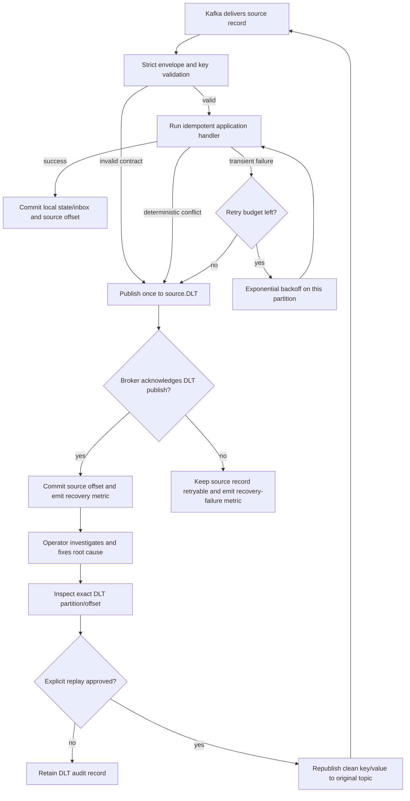

# Kafka Consumer Failure Flow

The retry is local to the failing source partition; other partitions continue. A source key is the aggregate/order ID, so short blocking retry also preserves per-aggregate ordering. Replay does not delete or mutate the DLT record and does not bypass normal validation, inbox, or state-machine rules.

Use `scripts/replay-dlt-record.ps1` only after the bad contract, data, configuration, or dependency has been corrected. The dry run prints only the topic location and key; it suppresses the message value and failure headers because older records may contain verbose stack traces.
