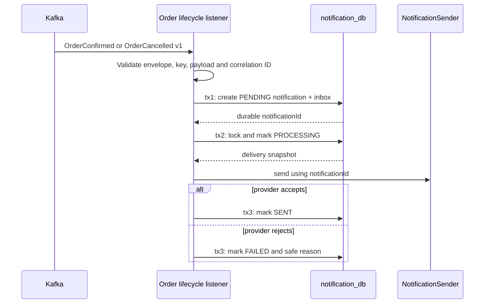

# Notification Delivery Flow

Status: **Terminal Order event consumption and simulated system delivery implemented.**

## Why the flow is asynchronous

Order completion is a business fact; sending a message is a secondary reaction. If notification delivery were a synchronous Order dependency, a slow provider could exhaust Order threads and a provider outage could make a successfully paid order appear to fail. Kafka allows Notification to lag temporarily while Order remains authoritative and available.

## Processing flow

The provider call is outside the transaction. An external system cannot participate in the PostgreSQL commit, and holding a database connection across uncontrolled latency would reduce capacity without creating atomicity.

## Duplicate handling

| Input | Result |
| --- | --- |
| Same event ID delivered again | Inbox locates the existing notification; `SENT` delivery is skipped |
| New event ID, same order and same terminal type | New inbox row records the semantic duplicate; no second notification is created |
| Same order with contradictory terminal type | Reject as a contract/state conflict and route to DLT |
| Redelivery while state is not `SENT` | Delivery may resume with the same notification ID |

Kafka's `orderId` key preserves ordering for one order inside the consumer group. Database uniqueness remains a defensive backstop rather than relying only on broker ordering.

## Failure matrix

| Failure | Durable state | Recovery |
| --- | --- | --- |
| Invalid/unknown event | No notification | Non-retryable DLT record |
| Database unavailable before acceptance | No inbox/notification | Bounded Kafka retry |
| Crash after acceptance | `PENDING` + inbox | Kafka redelivery can resume delivery |
| Provider rejects delivery | `FAILED` + attempt count | Future retry worker scans indexed failure state |
| Crash after provider accepts but before `SENT` | `PROCESSING` | Retry with the same provider idempotency key |
| Duplicate after `SENT` | Existing `SENT` row | No provider call |

Exactly-once external delivery is not promised. A future provider adapter must pass `notificationId` as its idempotency key; otherwise the last crash window can produce duplicate customer messages.
