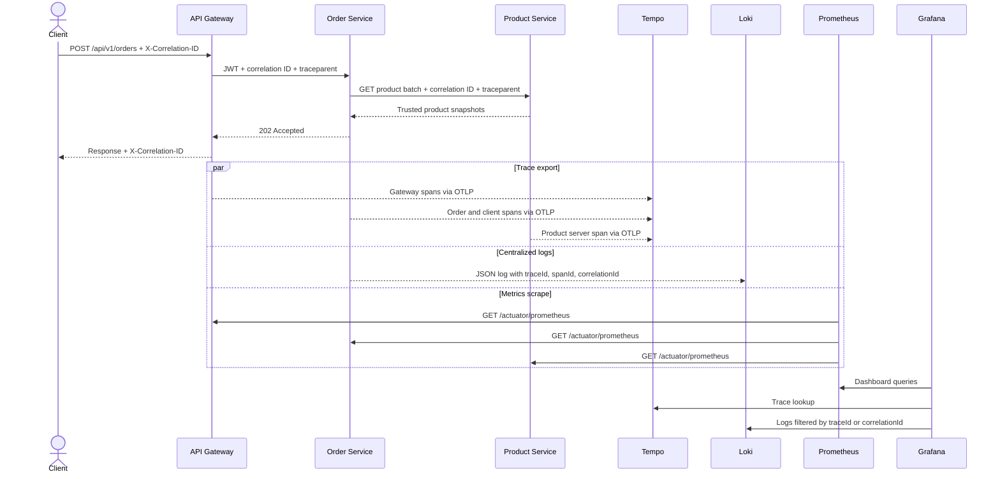

# Observability Request Flow

The following sequence shows how one order request creates signals without changing the business contract.

One verified local run produced a single trace spanning Gateway, Order, and Product. The Order creation log contained the same trace ID plus the stable business correlation ID. Later outbox and Kafka work can be found through that correlation ID even when it belongs to a different trace segment.

