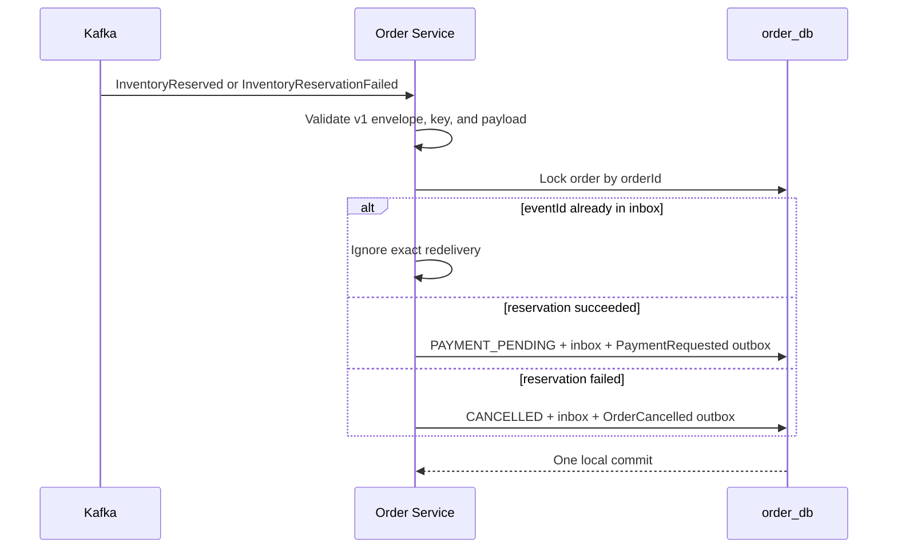

# Order Creation Flow

## Implemented Synchronous Acceptance

```mermaid
sequenceDiagram
    autonumber
    actor C as Customer
    participant G as API Gateway
    participant J as Auth JWKS
    participant O as Order Service
    participant P as Product Service
    participant D as order_db

    C->>G: POST /api/v1/orders + JWT + Idempotency-Key
    G->>J: Fetch/cache public key when needed
    G->>G: Verify token, role, correlation ID
    G->>O: Relay JWT, key, body, correlation ID
    O->>J: Fetch/cache public key when needed
    O->>O: Verify JWT; customerId = sub
    O->>D: Find customer + idempotency key
    alt matching request already exists
        D-->>O: Existing order + items
        O-->>G: 202 same order
    else key reused with different request
        D-->>O: Existing order with different hash
        O-->>G: 409 idempotency conflict
    else new request
        alt Product circuit is open
            O-->>G: 503 without a network call
        else Product circuit permits the call
            O->>P: GET product batch (bounded timeout)
            alt transient network/5xx failure
                P--xO: Transient failure
                O->>P: One bounded retry
            end
            P-->>O: Trusted active product data
            O->>D: Local transaction: insert order + snapshots + outbox command
            D-->>O: Committed PENDING order
            O-->>G: 202 + Location
        end
    end
    G-->>C: Normalized response + correlation ID
```

The Product call is synchronous because Order cannot truthfully accept an order without an authoritative current price and sale status. It is an internal direct call; routing it through Gateway would add an unnecessary dependency and mix public-edge concerns into service communication.

## Transaction Boundary

```text
No DB transaction: validate identity -> idempotency pre-check -> Product HTTP call
Local DB transaction: re-check key -> insert customer_orders -> insert order_items
                      -> insert InventoryReservationRequested outbox -> commit
```

The second key check plus database uniqueness handles the race where two identical requests arrive together. PostgreSQL is the final arbiter; an in-memory lock would fail once multiple Order instances run.

## Failure Matrix

| Failure | Response/state | Why |
| --- | --- | --- |
| Invalid/forbidden JWT | `401`/`403`, no Product call | Reject at trust boundary |
| Same key, same request | `202`, original order | Safe client retry |
| Same key, different request | `409`, no Product call | Prevent key ambiguity |
| Missing/inactive product | `422`, no order | Business input cannot be accepted |
| Product timeout/unavailable | `503`, no order | No trusted snapshot exists |
| Product circuit open | Fast `503`, no network/DB call | Protect the failing dependency and Order resources |
| Concurrent duplicate insert | Read committed winner | DB unique constraint closes race |
| Another customer reads order | `404` | Enforce ownership without leaking existence |

## Implemented Asynchronous Saga Progression

The accepted `PENDING` order writes an outbox command in the same local transaction. A scheduled publisher sends it to `inventory.commands.v1` and marks the row published only after broker acknowledgment. Inventory consumes the command and publishes an outcome.



The inbox record, order transition, and next outbox message share one transaction. A crash cannot leave a changed order without its next durable command. Exact redelivery is ignored by `eventId`; a new event ID describing a transition already applied is also recorded without emitting another command. Contradictory outcomes are sent to the DLT rather than silently rewriting history.

Returning `202` still represents accepted workflow state, not a claim that the whole purchase completed. A successful reservation reaches `PAYMENT_PENDING`, and Payment consumes the resulting command and publishes a durable outcome. Order then atomically reaches `CONFIRMED` and requests inventory confirmation, or reaches `CANCELLED` and compensates the reservation with `InventoryReleaseRequested`. Clients query the order resource to observe this eventual result.
