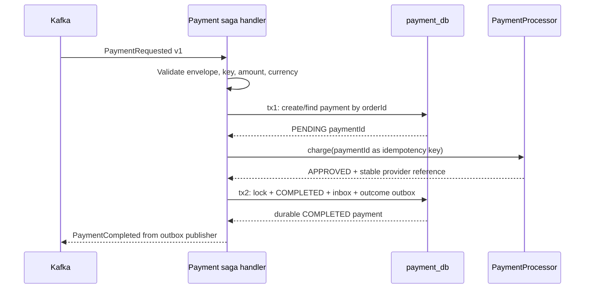
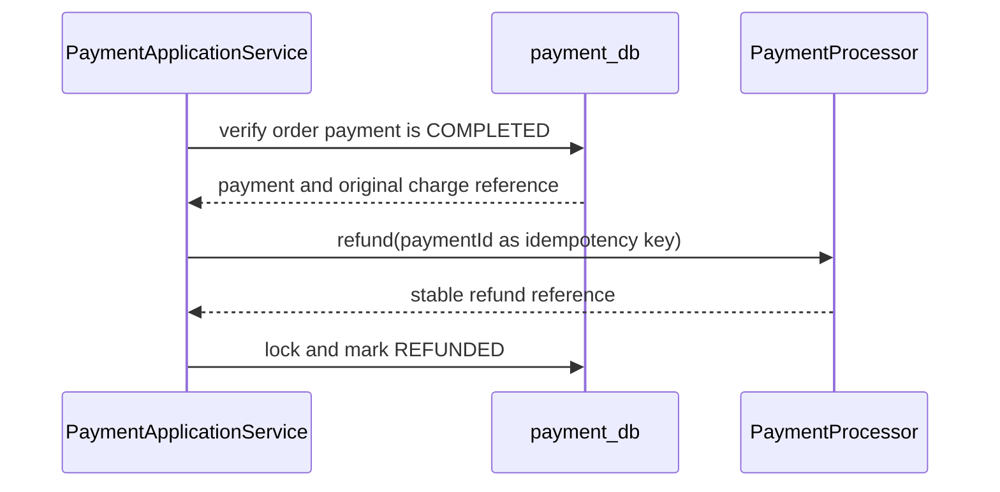

# Payment Processing Flow

Status: **Payment Kafka participant and outcome publication implemented.**

## Successful Charge

The provider call is deliberately between the two database transactions. The second transaction makes the payment result, processed command, and next event indivisible inside `payment_db`.

## Idempotent Replay

If the existing payment is `COMPLETED`, `FAILED`, or `REFUNDED`, the application returns it without calling the processor. If it is `PENDING`, the processor may be called again with the same `paymentId`. The processor contract must return the same business outcome/reference for that key.

Reusing an `orderId` with a different amount or currency is a conflict. This prevents a duplicate delivery with corrupted commercial data from silently reusing an earlier charge.

## Failure Matrix

| Failure | Durable payment state | Retry behavior |
| --- | --- | --- |
| Provider business decline | `FAILED` with `DECLINED` | Terminal replay; do not call provider again |
| Provider unavailable during charge | `PENDING` | Retry charge with the same `paymentId` |
| Crash after charge but before tx2 | `PENDING` | Provider idempotency returns the original result, then tx2 applies it |
| Crash after tx2 but before Kafka acknowledgment | Terminal state + unpublished/published outbox | Publisher retries; Order inbox will suppress duplicates |
| Provider returns a different reference for an existing completion | Existing terminal state | Reject as a processor contract violation |
| Provider unavailable during refund | `COMPLETED` | Retry refund with the same `paymentId` |
| Concurrent duplicate initialization | One row wins unique `order_id` | Loser reads and reuses the winning payment |

## Refund

Refund is valid only from `COMPLETED`. Replaying a completed refund returns the existing record without another provider call.

## Why No Long Database Transaction

Holding a database transaction open across a provider call consumes a connection and keeps locks while latency is uncontrolled. It still cannot roll back a real provider charge. Two short local transactions make the non-atomic boundary explicit; stable provider idempotency closes the charge crash window, while the inbox/outbox closes the local-state-to-Kafka publication window.
