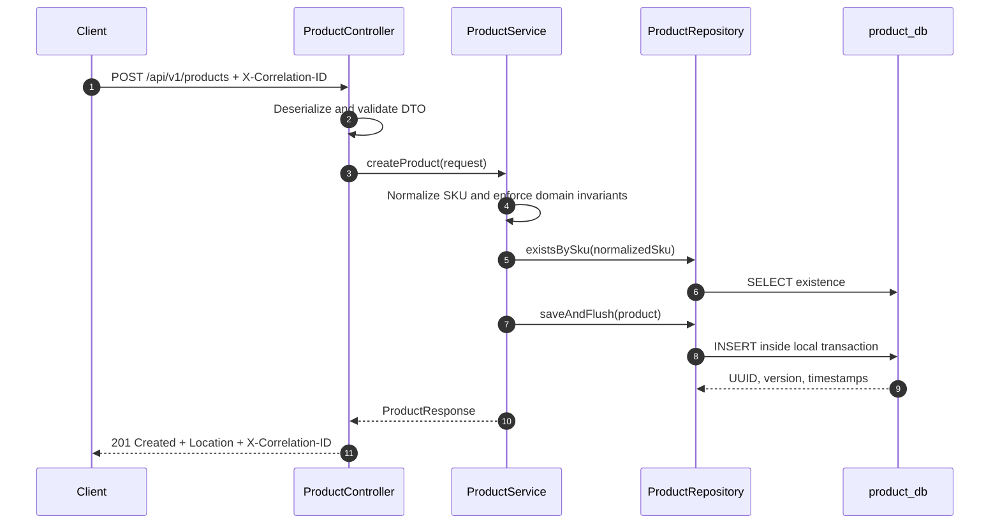
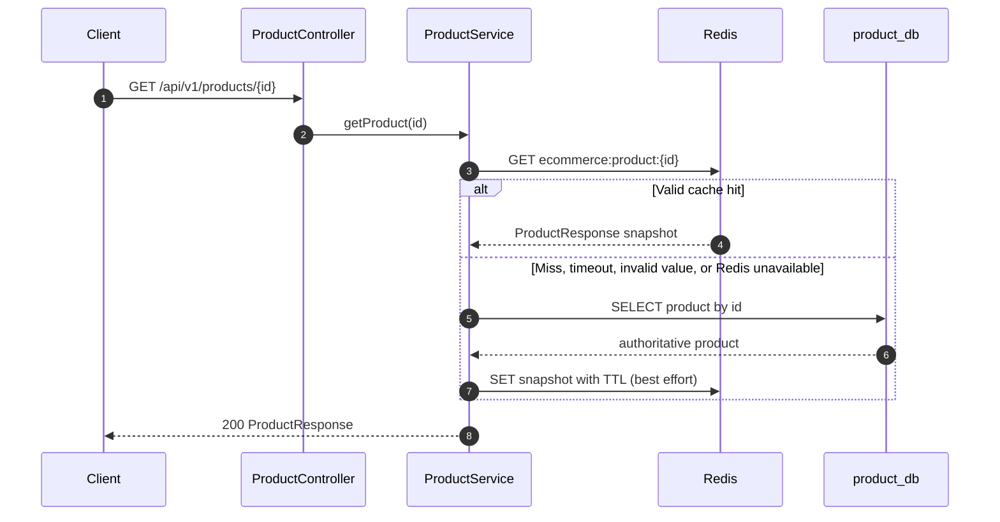
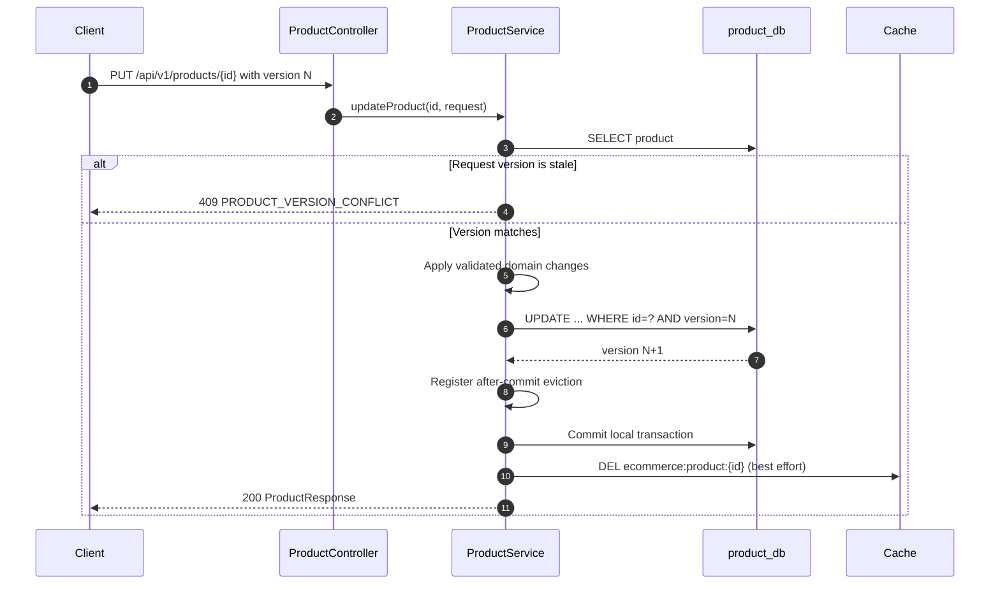

# Product Service Request Flow

## Ownership

Product Service is authoritative for product identity, catalog text, status, current price, and currency. It does not own stock. A caller that needs availability must ask Inventory Service rather than infer it from catalog status.

## Create Product

The pre-insert existence check produces a useful business error in the normal duplicate case. It cannot prevent a race between two requests, so the unique database constraint is authoritative. `saveAndFlush` makes that constraint fail before the application returns success.

## Read Product with Cache-Aside

PostgreSQL remains authoritative. Redis failures become misses and never change the HTTP contract. A batch request uses one Redis multi-get, one PostgreSQL query for all misses, then pipelined Redis writes. Search is deliberately not cached because filter combinations create high-cardinality keys and require broader invalidation.

## Update Product

The application check explains the conflict clearly. JPA `@Version` adds the real atomic guard at the database write, covering the race where two requests both read version N before either commits. Cache eviction runs after commit: evicting before commit would allow a concurrent reader to repopulate the old database value and keep it after the update succeeds.

## Transaction Boundary

Each create or update method has one local PostgreSQL transaction. A read method is marked read-only. This transaction cannot include another microservice: when Order later obtains a product snapshot over HTTP, Product's read transaction and Order's write transaction remain independent.

## Failure Behavior

| Failure | Result |
| --- | --- |
| Invalid request DTO/query parameter | `400 VALIDATION_ERROR` or `MALFORMED_REQUEST` |
| Unknown product | `404 PRODUCT_NOT_FOUND` |
| Duplicate normalized SKU | `409 PRODUCT_SKU_CONFLICT` |
| Stale update | `409 PRODUCT_VERSION_CONFLICT` |
| Redis unavailable or command timeout | Continue from PostgreSQL; increment bounded cache-error metrics |
| Cache eviction failure | Update still succeeds; TTL bounds possible stale reads |
| Unexpected internal failure | Sanitized `500 INTERNAL_ERROR`; full detail only in server logs |

Every response preserves or creates `X-Correlation-ID`. The same value is placed in the logging MDC so an API error can be matched to service logs.
