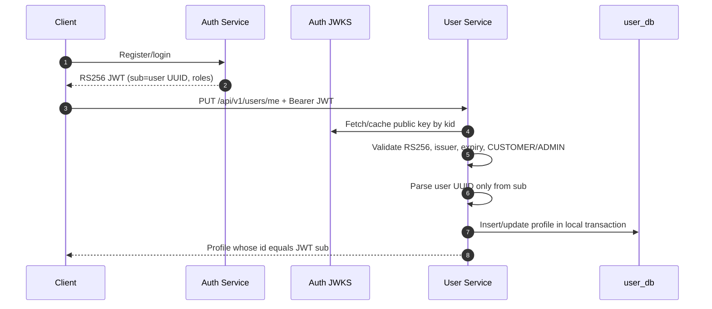

# User Profile Flow

## Authenticated Profile Completion



User does not call Auth for every request. JWKS supplies public verification material and is cached. Key retrieval has bounded connection/read timeouts; a cached key lets normal validation remain local during a temporary Auth outage.

## Owned Address Mutation

```mermaid
sequenceDiagram
    participant Client
    participant User as User Service
    participant DB as user_db

    Client->>User: PUT /me/addresses/{addressId} + JWT
    User->>User: userId = verified JWT sub
    User->>DB: Fetch profile + addresses by userId
    alt address belongs to profile
        User->>DB: Update aggregate; commit constraints/version
        User-->>Client: 200 address
    else unknown or belongs to another profile
        User-->>Client: 404 ADDRESS_NOT_FOUND
    end
```

The query begins from the authenticated profile, not from a globally fetched address followed by an optional check. This makes ownership part of how the resource is located and avoids leaking that another user's address exists.
