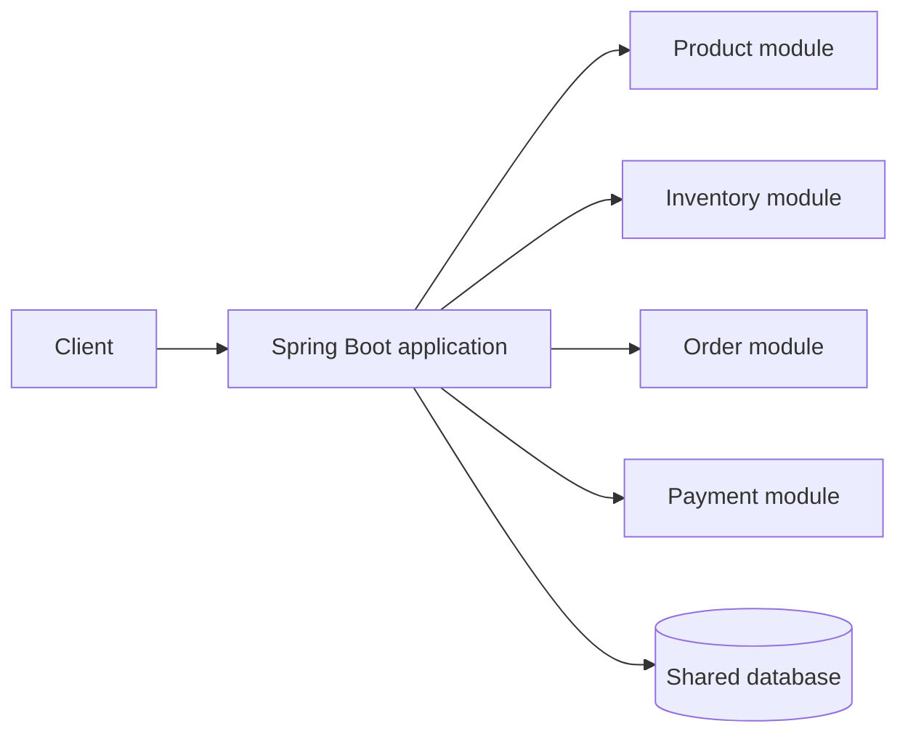
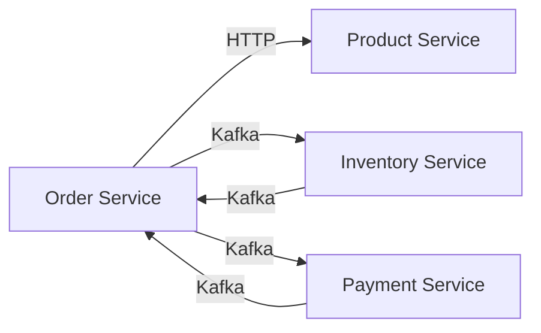

# 01 - Monolith vs Microservices

## What is it?

A monolith deploys the application's business capabilities as one process. Microservices deploy selected capabilities as separate processes with explicit network contracts and independent data ownership.

“Monolith” does not mean bad design. A well-structured modular monolith is often the best starting point. “Microservices” does not mean one service per table or class.

## Why does it exist?

Microservices address organizational and runtime needs such as independent deployment, different scaling profiles, stronger failure isolation, and autonomous ownership. They add network latency, partial failure, eventual consistency, operational overhead, and more difficult debugging.

Use microservices when those benefits justify the costs, not because they are fashionable.

## Monolith

In a monolithic e-commerce application, Product, Inventory, Order, and Payment modules can call Java methods and share one database transaction:



An order operation may update order, inventory, and payment tables within one ACID transaction. Deployment and scaling affect the complete application.

## Microservices

In this project, these capabilities run as separate Spring Boot applications. A Java call becomes HTTP or Kafka communication. Each service commits only its database. Failure can occur after one participant succeeds and before another receives the result.



This is why the project needs timeouts, idempotency, saga compensation, correlation IDs, and distributed tracing later.

## This Project

- Service boundaries: `docs/architecture/service-boundaries.md`
- Database ownership: `docs/architecture/database-architecture.md`
- Target workflow: `docs/architecture/system-overview.md`
- Monorepo decision: `docs/decisions/001-monorepo.md`

The initial `product-service` already builds and runs independently. Other boundaries remain documented targets until their code is implemented.

## Request Flow

```text
Monolith:      HTTP -> controller -> Java method -> one database
Microservices: HTTP -> Gateway -> service -> network/event -> another service/database
```

## Trade-offs

Advantages include independent deployments, targeted scaling, explicit ownership, and isolation of some failures. Costs include more infrastructure, contract evolution, duplicated technical code, distributed consistency, and harder local development.

## Common Mistakes

- Splitting by technical layer, such as one “controller service” and one “repository service.”
- Creating many services before understanding business boundaries.
- Sharing a database and calling the result microservices.
- Assuming the network is reliable or fast.
- Using Kafka for every interaction.
- Treating independent deployment as permission to duplicate inconsistent business rules.

## Interview Questions

1. When would a modular monolith be preferable to microservices?
2. Which new failure modes appear when a method call becomes an HTTP call?
3. Why does database-per-service make cross-service transactions difficult?
4. Can a monorepo still contain independently deployable microservices?
5. What is a distributed monolith?

## Practical Exercise

Draw a modular-monolith version of this project. Mark which calls become local Java calls and which order operations could share one transaction. Then compare it with `docs/architecture/system-overview.md`.
