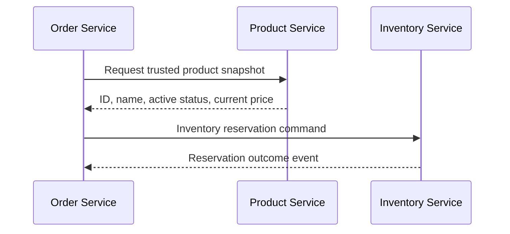

# 02 - Service Boundaries

## What is it?

A service boundary groups business behavior and data that change together under one owner. A useful boundary protects its invariants without constantly coordinating with other services.

Boundaries are closer to business capabilities or bounded contexts than database tables. Product and Inventory are separate because “what we sell” and “what we can promise right now” have different rules and workloads, not because they use different tables.

## Why does it exist?

Without clear boundaries, services repeatedly access each other's data, duplicate decisions, create cycles, and must deploy together. The result is a distributed monolith with network overhead but little independence.

## Monolith

A monolith can preserve the same conceptual boundaries as modules. Modules can call each other in memory, and one database may enforce relationships between them. Poor module boundaries still hurt maintainability, but network and deployment coupling are not added yet.

## Microservices

A microservice boundary is also a process, deployment, API, and data-ownership boundary. Crossing it introduces latency, versioned contracts, authentication, failure handling, and consistency decisions.

For example, Order cannot hold a JPA relationship to Product. It stores `productId` plus the product name and price accepted at ordering time. Current catalog details remain owned by Product.

## This Project

The authoritative matrix is `docs/architecture/service-boundaries.md`.

Examples:

- `Product Service`: current catalog and prices, not stock.
- `Inventory Service`: stock and reservations, not descriptions.
- `Order Service`: order history, price snapshots, and workflow, not payment records.
- `Auth Service`: credentials and tokens, not customer profile.
- `Notification Service`: delivery, not the business decision to confirm an order.

No service may import another service's JPA entities or repository package.

## Request Flow

The synchronous Product lookup is justified by immediate order validation. Inventory reservation becomes a durable asynchronous saga step.

## Trade-offs

A larger boundary reduces network coordination and simplifies transactions but can become a deployment and ownership bottleneck. A smaller boundary increases autonomy but adds contracts and distributed failure modes. The best boundary minimizes coordination around important invariants rather than minimizing code size.

## Common Mistakes

- One service per entity or table.
- Putting shared business entities in a common library.
- Allowing Order to update Inventory tables “for performance.”
- Creating circular synchronous calls.
- Letting Gateway orchestrate business workflows.
- Duplicating authoritative data without defining snapshot or cache semantics.

## Interview Questions

1. What signals show that two capabilities belong in the same service?
2. Why are Product and Inventory separate in this project?
3. What is wrong with sharing JPA entities across services?
4. Why does Order store a product price snapshot?
5. How can a team detect a distributed monolith?

## Practical Exercise

Review the ownership matrix and propose where a shopping-cart capability should live. Compare a separate Cart Service with keeping a draft order in Order Service, including consistency, lifecycle, and scaling trade-offs.
