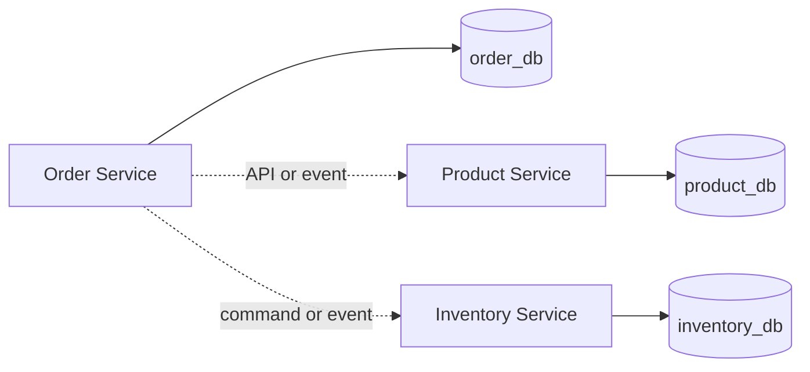

# 03 - Database per Service

## What is it?

Database-per-service means one service exclusively owns a logical data store and its schema. It does not require a dedicated physical database server from day one. The critical rule is that no other service can query or mutate that data directly.

## Why does it exist?

Exclusive ownership allows a service to evolve its schema, migrations, availability, and implementation without coordinating every change with consumers. Other services depend on stable APIs and events rather than internal tables.

## Monolith

A monolith commonly uses one database. Modules can join tables, enforce foreign keys across business areas, and update multiple areas in one ACID transaction. Good modular discipline can still restrict repository access, but the database technically permits coupling.

## Microservices

Each service uses separate credentials and migrations. Cross-service joins disappear. Data composition moves to APIs, events, read models, or immutable snapshots. Multi-service updates require eventual consistency and sagas instead of one database transaction.

For example, `order_db` cannot have a foreign key to `product_db`. Order stores a product UUID and accepted snapshot; Product can change or even archive the current catalog entry without rewriting history.

## This Project

The target mapping is documented in `docs/architecture/database-architecture.md` and ADR 002.

Each persistent service will contain:

- Flyway migrations under `src/main/resources/db/migration/`
- A datasource configured through environment variables
- `spring.jpa.hibernate.ddl-auto=validate`
- Database constraints and indexes aligned with real queries
- Repository integration tests using PostgreSQL Testcontainers

Local Compose runs separate databases and users on one PostgreSQL container. This saves resources while preventing accidental cross-database joins through application credentials.

## Request Flow

The dotted connections are contracts. There is no connection from Order Service to `product_db` or `inventory_db`.

## Trade-offs

Benefits include ownership, independent schema evolution, least-privilege access, and deployability. Costs include duplicated snapshots, harder reporting, eventual consistency, more migrations/backups, and the absence of cross-service ACID transactions.

Analytics should use an explicit pipeline or reporting store later rather than granting reporting code unrestricted access to operational databases.

## Common Mistakes

- Calling separate schemas in one shared user “database per service” while every service can query everything.
- Creating foreign keys across service databases.
- Sharing migration scripts between services.
- Using Hibernate `ddl-auto=update` in production-style environments.
- Treating a local shared PostgreSQL container as permission for cross-service joins.
- Copying data without defining who is authoritative and how updates propagate.

## Interview Questions

1. Does database-per-service require one physical server per service?
2. How do you perform a join across service-owned data?
3. Why can `@Transactional` not roll back another service's database?
4. How do immutable snapshots reduce runtime coupling?
5. What does a transactional outbox solve?

## Practical Exercise

Design the minimum `products` and `order_items` columns. Identify which values Order must snapshot and explain why `order_items.product_id` cannot have a database foreign key to Product Service.
