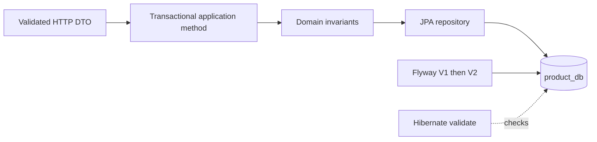

# JPA, Flyway, and Local Transactions

## What Is It?

JPA maps Java domain state to relational rows. Flyway applies ordered, immutable SQL migrations. A local database transaction makes a group of operations against one service-owned database succeed or fail atomically.

These tools solve different problems: JPA handles runtime persistence, Flyway controls schema history, and `@Transactional` defines atomic work. Hibernate is configured to validate the migrated schema, not create it.

## Why Does It Exist?

Application code and database structure evolve at different times. Relying on automatic schema generation hides changes, makes rollback planning difficult, and can produce different schemas between environments. Versioned SQL is reviewable and repeatable.

A transaction is needed because partial local updates can violate an invariant. For example, returning success before a unique SKU constraint is checked would make the API lie to the client.

## Monolith

A monolith commonly uses one database and can place product, stock, order, and payment rows in one ACID transaction. One `@Transactional` method may update all of them because all repositories use the same transaction manager and connection boundary.

That is operationally simple, but it also encourages modules to reach across ownership boundaries and makes schema deployment a coordinated event for the whole application.

## Microservices

Each persistent service owns its database and transaction manager. Product Service can atomically change `product_db`; it cannot include `inventory_db` or `order_db` in the same ordinary Spring transaction.

Cross-service work therefore needs explicit communication and failure handling. Later, the order workflow uses local transactions plus Kafka, idempotency, and compensation rather than pretending one annotation creates a distributed transaction.

## This Project

- `services/product-service/src/main/java/com/example/ecommerce/product/domain/Product.java` maps one aggregate with no relationships and uses `@Version` for optimistic locking.
- `services/product-service/src/main/java/com/example/ecommerce/product/service/ProductService.java` places transactions at application use-case boundaries. Queries are read-only.
- `services/product-service/src/main/java/com/example/ecommerce/product/repository/ProductRepository.java` owns JPA access; controllers never use it.
- `services/product-service/src/main/resources/db/migration/V1__create_products_table.sql` establishes keys, constraints, indexes, status values, and timestamps.
- `V2__add_product_currency.sql` demonstrates forward-only schema evolution after V1 was published.
- `application.yml` uses `ddl-auto: validate` and disables Open Session in View.
- `ProductRepositoryTest` and `ProductApiIntegrationTest` use PostgreSQL Testcontainers, so migrations and vendor behavior are exercised rather than replaced by H2.

## Request Flow

## Trade-offs

Explicit SQL migrations require more care than automatic DDL, but they make production changes observable and reviewable. JPA reduces persistence boilerplate, but lazy loading, persistence context behavior, and generated queries must be understood.

Optimistic locking avoids holding database locks while users edit data and works well when conflicts are uncommon. Under very high write contention it may cause repeated conflicts; pessimistic locking or atomic update queries can then be a better fit. Inventory will evaluate that different workload separately.

## N+1 Review

N+1 occurs when one query loads a list and then another query runs for each related entity. Product currently has no JPA relationships, so this path does not exist. Adding `EAGER` collections preemptively would create larger and less predictable queries, not solve a demonstrated problem.

When a relationship is later justified, review its access pattern and use an explicit fetch join, entity graph, or projection for the particular query that needs it.

## Common Mistakes

- Using `ddl-auto=update` in production and losing reviewable schema history.
- Editing an already applied Flyway migration instead of adding the next version.
- Putting `@Transactional` on a controller or assuming it spans HTTP/Kafka calls.
- Checking uniqueness only in Java and omitting the database constraint, which fails under races.
- Exposing a managed JPA entity through JSON and accidentally triggering lazy queries.
- Making all relationships eager to hide `LazyInitializationException`.

## Interview Questions

1. Why use both a Java duplicate check and a unique database constraint?
2. What does `ddl-auto=validate` protect against, and what does it not do?
3. Why can `@Transactional` not atomically update two independent microservices?
4. How does optimistic locking prevent a lost update?
5. Why are PostgreSQL Testcontainers tests more trustworthy than H2 for PostgreSQL-specific migrations?

## Practical Exercise

Add an optional `brand` filter without exposing arbitrary entity fields:

1. Create a forward-only Flyway migration and domain field.
2. Add DTO validation and a specification predicate.
3. Add a database index only if the intended query makes it useful.
4. Extend repository, MVC, and integration tests.
5. Explain whether `brand` belongs to Product Service or another bounded context.
