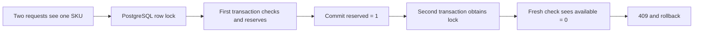

# Concurrency and Inventory Reservations

## What Is It?

Concurrency means multiple requests can read and change the same data at nearly the same time. An inventory reservation temporarily promises units to one order without considering them sold yet.

## Why Does It Exist?

If two customers both read `available = 1`, each may decide that one unit is available. Without an atomic guard, both decrement or reserve it and the store promises two units it owns only once. This is a lost-update/overselling problem, not merely an HTTP validation problem.

## Monolith

A monolith can place order creation and stock updates in one database transaction. It can lock the inventory row, insert the order, and commit both together. The database supplies one ACID boundary, although long transactions and lock contention still need care.

## Microservices

Order Service and Inventory Service own different databases, so there is no ordinary Spring transaction covering both. Inventory must make reservation a durable local result. Order will later observe success/failure through events and use compensation if a later payment step fails.

## This Project

- `InventoryItem` owns total/reserved invariants and exposes reserve/release/confirm behavior.
- `InventoryItemRepository.findAllByProductIdInForUpdate` obtains PostgreSQL row locks in a single ordered query.
- `InventoryService.reserve` defines the all-or-nothing transaction boundary.
- `InventoryReservation` records the promise and uses `orderId` for synchronous retry idempotency.
- `V1__create_inventory_schema.sql` repeats critical quantity/status rules as database constraints.
- `InventoryApiIntegrationTest.concurrentReservationsCannotOversellOneAvailableUnit` proves two threads cannot reserve one unit twice.

## Request Flow

## Alternatives and Trade-offs

### Optimistic locking

Both requests proceed and one fails its versioned update. This avoids holding locks and works well when conflicts are rare, but the application must retry or report conflicts. Product editing uses this model.

### Pessimistic locking

Conflicting transactions wait for the row owner. It makes multi-line all-or-nothing reservation straightforward and predictable under stock contention. Waiting consumes database connections, so transactions must stay short and never perform network calls while holding locks. This is the chosen model.

### Atomic conditional update

An SQL statement such as `UPDATE ... SET reserved = reserved + ? WHERE available >= ?` is efficient for one SKU. Coordinating many lines while reporting exactly which line failed takes more work. It is a strong future optimization if profiling shows the lock-and-entity approach is a bottleneck.

## Deadlocks

Two orders containing products A and B could deadlock if one locks A then B while another locks B then A. The repository request sorts product UUIDs before the locking query, giving all transactions the same acquisition order. Database deadlocks must still be monitored because other code paths can introduce different lock orders.

## Common Mistakes

- Reading availability and updating later without a lock/version/conditional update.
- Decrementing stock directly without a reversible reservation state.
- Holding a database lock while calling Payment or another service over HTTP.
- Retrying a non-idempotent reservation and creating a second hold.
- Keeping quantity in Product Service and letting Order update the Product database.
- Making reservation items eager everywhere to hide lazy-loading mistakes.

## Interview Questions

1. Why does a Java `if (available >= requested)` not prevent overselling by itself?
2. When would optimistic locking be better than pessimistic locking?
3. Why must multi-product locks use a consistent order?
4. How does confirmation differ from release in the quantity model?
5. Why can `@Transactional` not make Order and Inventory atomic across databases?

## Practical Exercise

Add an integration test with two orders that request the same two products in opposite input order. Prove both calls complete without deadlock and that final quantities satisfy every constraint. Then explain why the service sorts IDs instead of trusting request order.
