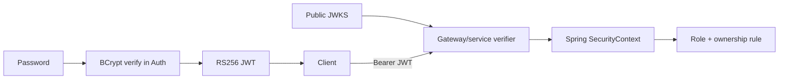

# Authentication in Microservices

## What Is It?

Authentication proves identity. Authorization decides what that identity may do. A JWT is a signed set of claims, not encryption and not a permission system by itself.

## Why Does It Exist?

Without a trusted identity boundary, each service might store passwords or invent its own login rules. That duplicates sensitive data and makes revocation, hashing upgrades, and incident response inconsistent.

## Monolith

A monolith often authenticates once, stores identity in an HTTP session, and shares one in-process `SecurityContext` across modules. A local authorization check can use the same user repository and transaction.

## Microservices

Processes do not share memory/session state. Auth issues a portable signed identity. Each receiving process must validate it and enforce its own authorization. Profile data is not copied into Auth merely because both domains use the same person ID.

## This Project

- `AuthAccount` owns normalized email, BCrypt hash, status, and roles in `auth_db`.
- `AuthService` implements register/login/refresh/logout transaction boundaries.
- `JwtTokenService` signs 15-minute RS256 access tokens.
- `RefreshTokenGenerator` creates 256-bit opaque tokens and SHA-256 hashes.
- `SecurityConfiguration` exposes public JWKS and maps `roles` to Spring `ROLE_*` authorities.
- `application-prod.yml` makes configured RSA keys mandatory in production.
- `AuthApiIntegrationTest` validates the JWT cryptographically and proves rotation/revocation behavior.

## Request Flow

## JWT Parts

A JWT has Base64URL header, payload, and signature. Anyone holding the token can decode header/payload; only a trusted private-key holder can create a valid signature. Therefore never put secrets in claims and never accept a token merely because it parses.

## Trade-offs

Local validation improves latency and Auth outage tolerance. It also means access-token changes/revocation are eventually visible at expiry. Short TTL reduces this window; refresh tokens remain stateful so logout and rotation can stop future access tokens.

## Common Mistakes

- Confusing Base64 encoding with encryption.
- Storing raw passwords or reversible encrypted passwords instead of slow hashes.
- Logging Authorization headers or refresh tokens.
- Sharing an HMAC signing secret with every service.
- Accepting a JWT without issuer/signature/expiry validation.
- Treating a valid JWT as permission to access another user's resource.
- Returning different login errors for unknown email and wrong password.
- Putting user profiles/passwords together merely because both use a user ID.

## Interview Questions

1. What is the difference between authentication and authorization?
2. Why use BCrypt rather than SHA-256 for passwords, but SHA-256 for random refresh tokens?
3. Why does RS256 reduce signing-key blast radius compared with a shared HMAC secret?
4. What is the access-token revocation trade-off with stateless JWT validation?
5. Why should both gateway and backend service validate/authorize a request?

## Practical Exercise

Write a test that activates the `prod` profile without configured RSA keys and assert startup fails. Then generate a test key pair, configure its DER values, and prove Auth starts with a stable `kid` across two contexts.
