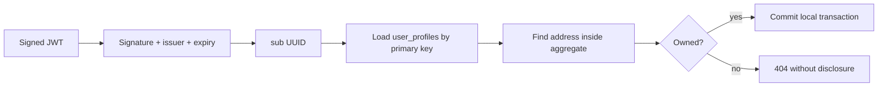

# Identity and Resource Ownership

## What Is It?

Identity says which principal made a request. Resource ownership says which business records that principal may read or change. A valid login proves identity; it does not automatically grant access to every UUID in the system.

## Why Does It Matter?

An insecure direct object reference occurs when a user changes an ID in a URL and reaches another user's data. Microservices amplify the risk because identity crosses network boundaries as claims and each service must remember to enforce its own ownership rules.

## Monolith

A monolith usually has one security context and can join the current user directly to profile/address tables. Ownership checks and data access happen in one process and database. They can still be omitted, but no token/key-discovery boundary exists between modules.

## Microservices

Auth cannot authorize every User record because it does not own profiles. It signs a stable subject. User validates that identity, then applies its own rule: profile primary key must equal `sub`, and an address must belong to that profile. The Gateway may reject obviously invalid traffic, but it cannot replace domain authorization in User.

## This Project

- Auth puts its account UUID in JWT `sub`.
- `SecurityConfiguration` validates RS256, issuer, expiry, and CUSTOMER/ADMIN roles.
- `UserProfileController` derives UUID from `Jwt.getSubject()`.
- `/api/v1/users/me` contains no client-selected profile ID.
- `UserProfileRepository.findWithAddressesById(sub)` starts every lookup at the owner.
- `UserProfile.address(addressId)` only searches that owned aggregate.
- `UserApiIntegrationTest.preventsCrossUserAddressAccess` proves a real user B token cannot delete user A's address.

## Request Flow

## Role vs Ownership

Role answers a broad question: is this principal a customer or administrator? Ownership answers a narrow question: does this address belong to this customer? `ROLE_CUSTOMER` alone is insufficient because every customer has that role. Secure endpoints need both checks when the resource is personal.

## Common Mistakes

- Decoding a JWT without verifying its signature and issuer.
- Accepting `userId` in both token and request body and trusting the body.
- Checking role but not ownership.
- Fetching an address globally, modifying it, and never checking its profile.
- Trusting identity headers from any caller instead of a controlled proxy boundary.
- Returning different errors for a missing resource and another user's resource, which leaks existence.
- Calling Auth on every request when local public-key validation is sufficient.

## Interview Questions

1. Why is a valid CUSTOMER token insufficient authorization for an address UUID?
2. What security bug does a `/me` API remove by construction?
3. Why validate JWT in User when Gateway will also validate it?
4. Why return 404 rather than 403 for another user's address?
5. What happens on a JWKS cache miss if Auth is unavailable, and why do timeouts matter?

## Practical Exercise

Add a test-only ADMIN endpoint design on paper for support staff to read a profile by ID. Specify its route, role check, audit fields, response data minimization, and whether an administrator should be able to mutate addresses. Do not implement it until the authorization and audit requirements are explicit.
