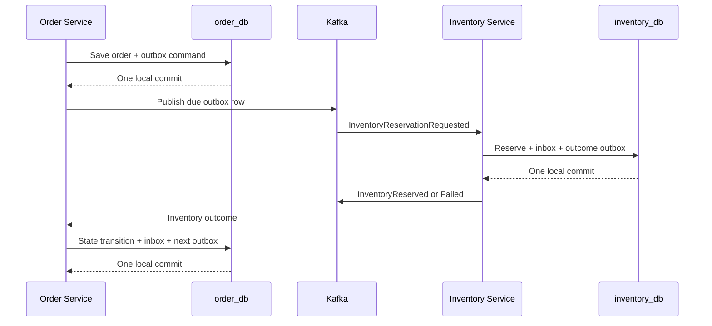

# 11. Transactional Outbox and Idempotent Consumers

## The Problem

Creating an order and asking Inventory to reserve stock are two writes to different systems: `order_db` and Kafka. A normal database transaction cannot atomically commit both.

The dangerous sequence is:

1. Commit the order.
2. Publish the inventory command.

If the process crashes between those steps, the order remains `PENDING` forever without a command. Reversing the order is also unsafe: Kafka may receive a command for an order that later fails to commit.

## In a Monolith

Order and Inventory might share one database transaction. A single commit could save the order and reserve stock. That is simple and strongly consistent, although an external payment provider still cannot join the database transaction safely.

## In Microservices

Order owns `order_db`; Inventory owns `inventory_db`. Neither service opens the other's connection or shares JPA entities. The workflow therefore uses local transactions plus durable messages:



The outbox closes the database-before-Kafka crash window. A scheduler publishes rows after the business transaction commits. It marks a row published only after the broker acknowledges it.

## Why Duplicates Still Exist

Suppose Kafka acknowledges the event, then the service crashes before `published_at` commits. On restart, the same outbox row is published again. Kafka producer idempotence reduces protocol-level duplicates within a producer session, but it does not atomically commit PostgreSQL and Kafka.

Consumers must therefore assume at-least-once delivery. Inventory stores the input `eventId` in `processed_events` in the same transaction as its stock change. A redelivery finds that inbox row and becomes a no-op.

Order applies the same rule when consuming Inventory outcomes. It locks the order row so competing outcomes for one order cannot both pass the state check. On success, the order transition, inbox row, and `PaymentRequested` outbox row commit together. On failure, cancellation, inbox, and `OrderCancelled` commit together. The state machine is a second idempotency barrier: a different event ID for an already-applied transition does not create another command.

The same pattern completes the Payment leg. Order locks a `PAYMENT_PENDING` order and commits either `CONFIRMED` plus two success outboxes, or `CANCELLED` plus two compensation/outcome outboxes. Because the state, inbox, and both outbox rows share one transaction, a crash cannot publish only half of the orchestrator's decision.

Notification applies the inbox rule before its external side effect: accepting a terminal Order event commits one `PENDING` notification plus the processed event. Exact and semantic duplicates resolve to the same row. The inbox cannot make an external provider exactly once, so delivery additionally uses the durable notification ID as a provider idempotency key.

## Transaction Boundaries

Successful reservation uses one local transaction:

```text
reserve stock + save reservation + save processed event + save outcome outbox
```

A known business failure needs a different path. The failed reservation transaction rolls back first. A new transaction then saves:

```text
processed event + InventoryReservationFailed outbox
```

Catching a runtime exception after a nested transactional method has already marked the transaction rollback-only and then trying to save the failure event in that same transaction would end with `UnexpectedRollbackException`.

## Retry Policy

- Invalid contract or unsupported version: do not retry; publish to the DLT for investigation.
- Temporary database or infrastructure failure: bounded retry.
- Insufficient stock or missing inventory item: valid business outcome, not an infrastructure retry.
- Outbox publication failure: retain the row and schedule exponential backoff.

The DLT is operational evidence, not a business recovery strategy. Operators still need alerts, dashboards, replay rules, and retention policies.

## Review Questions

1. Why must the inbox row share the Inventory transaction instead of being written before reservation?
2. What happens if a service marks an outbox row published before Kafka acknowledges it?
3. Why does Kafka producer idempotence not remove the need for a consumer inbox?
4. Which failures should become `InventoryReservationFailed`, and which should be retried?
5. Why is `orderId` used as the Kafka key for all commands in one order saga?
