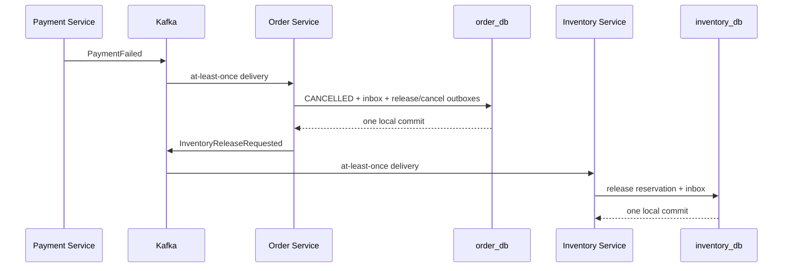

# 12. Saga Compensation and Eventual Consistency

## The Problem

Inventory can commit a reservation before Payment knows whether a charge will succeed. If Payment later declines, the earlier Inventory transaction has already finished in another database. There is no safe `rollback()` call that reaches backward across services.

## Why Microservices Need Compensation

Each service owns an independent transaction boundary:

```text
inventory_db: reservation committed
payment_db:   charge declined
order_db:     must decide the business outcome
```

Order therefore issues `InventoryReleaseRequested`. This is a new business operation with its own delivery, retry, idempotency, and observability requirements. It compensates the effect of reservation; it does not erase history.

## In a Monolith

If Order and Inventory shared one database and no external provider were involved, one transaction could update both tables and roll back before commit. Payment providers still sit outside that database, so even a monolith needs idempotent provider calls and explicit refund/release behavior around external side effects.

## In Microservices



The workflow is eventually consistent. For a short period the order may be `PAYMENT_PENDING` while inventory remains reserved. Durable messages and retries make the services converge to `CANCELLED` plus `RELEASED` after a decline, or `CONFIRMED` plus confirmed inventory after success.

## Why Order Is the Orchestrator

Order owns the customer-visible state machine, so it decides which participant command follows each outcome. Payment does not need to understand inventory rules, and Inventory does not need to understand payment states. This concentrates workflow logic in Order but keeps participant boundaries independent.

## Atomic Orchestrator Decision

On payment success, one `order_db` transaction writes:

```text
order CONFIRMED
+ processed PaymentCompleted event
+ InventoryConfirmationRequested outbox
+ OrderConfirmed outbox
```

On payment decline, one transaction writes:

```text
order CANCELLED(PAYMENT_FAILED)
+ processed PaymentFailed event
+ InventoryReleaseRequested outbox
+ OrderCancelled outbox
```

If any write fails, the whole local transaction rolls back. Kafka publication happens afterward through the outbox publisher.

## Idempotency and Contradictions

- Same `eventId`: inbox suppresses exact redelivery.
- New event ID for an already-applied terminal result: record it without emitting more commands.
- `PaymentCompleted` after a payment-failure cancellation, or `PaymentFailed` after confirmation: reject as a contradictory outcome and route to the DLT.
- All saga records use `orderId` as the Kafka key so one order's events retain partition ordering.

## Review Questions

1. Why is inventory release a new transaction instead of a rollback?
2. What temporary states can a client observe while the saga converges?
3. Why must both terminal outbox rows share the Order transaction?
4. What would go wrong if Payment called Inventory directly?
5. Which signal should trigger Notification: `PaymentCompleted` or `OrderConfirmed`, and why?
