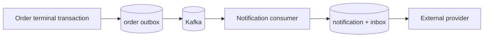

# 13. Asynchronous Notifications and Delivery Semantics

## What is it?

An asynchronous notification is secondary work triggered by a durable business event. The producer records that an order was confirmed or cancelled; a separate consumer later creates and delivers a customer message.

## Why does it exist?

Email, SMS, push, and third-party providers are slower and less reliable than a local database. Making them part of order completion couples business availability to a secondary system. Asynchronous processing lets the core transaction finish while delivery catches up.

## Monolith

A monolith may update an order and insert a notification job in one database transaction. A background worker reads the job after commit. Calling an email provider inside that transaction is still unsafe: database rollback cannot undo an email already accepted by the provider.

## Microservices

Order and Notification have separate databases, so even the job insert cannot share the Order transaction. Order writes its terminal event to a transactional outbox. Notification receives the Kafka record later and writes its notification plus inbox in one local transaction.



This flow provides at-least-once processing and durable progress, not a global transaction.

## This project

- Producer: `OrderEventFactory` creates `OrderConfirmed` or `OrderCancelled` on `order.events.v1`.
- Contract boundary: `OrderLifecycleEventParser` strictly validates v1 envelopes without importing Order classes.
- Acceptance transaction: `NotificationAcceptanceService` saves `CustomerNotification` and `ProcessedEvent` together.
- Delivery transactions: `NotificationDeliveryTransactionService` claims and finalizes a delivery in short transactions.
- External boundary: `NotificationSender` is implemented by `SimulatedNotificationSender`.
- Persistence: Flyway creates `notifications` and `processed_events` in `notification_db`.
- Failure routing: `KafkaListenerConfiguration` distinguishes poison/conflicting events from retryable infrastructure failures.

The first channel is `SYSTEM`, not email. The event contains `customerId` but no verified email, and Notification must not query `user_db`. Adding an email address to every event improves autonomy but duplicates personal data; resolving User synchronously increases coupling; consuming a user-contact projection adds eventual consistency and privacy responsibilities. That choice is deferred until email is a real requirement.

## Request flow

```text
Order CONFIRMED/CANCELLED + outbox commit
  -> Kafka terminal event
  -> Notification PENDING + inbox commit
  -> claim PROCESSING
  -> simulated provider
  -> SENT or FAILED
```

## Delivery guarantees

“Exactly once” has two different meanings here:

- The database can guarantee one notification row per order/channel with a unique constraint.
- PostgreSQL and an external provider cannot atomically commit together.

If the provider accepts a send and the process crashes before `SENT` commits, a retry may send again. The practical solution is at-least-once attempts plus a stable provider idempotency key (`notificationId`). The provider returns the original result for repeated keys.

## Trade-offs

- Advantage: Order availability is independent of notification delivery.
- Advantage: delivery state, failures, and attempts are observable and recoverable.
- Cost: customers may receive messages after a delay.
- Cost: another database, consumer, schema, deployment, and operational queue must be maintained.
- Limit: `FAILED` and abandoned `PROCESSING` rows need a later retry/recovery worker and alerts.

## Common mistakes

- Triggering the notification from `PaymentCompleted` even though the overall order can still fail.
- Calling a provider inside the Order transaction.
- Marking a Kafka record processed before the notification row commits.
- Assuming Kafka or an idempotent producer makes the consumer exactly once.
- Retrying provider calls without a stable idempotency key.
- Logging message content or personal addresses unnecessarily.
- Sharing Order event DTO classes as a common business library.

## Interview questions

1. Why should Notification consume `OrderConfirmed` instead of `PaymentCompleted`?
2. Which writes share the Notification acceptance transaction, and why?
3. What crash window remains between PostgreSQL and an external provider?
4. How do exact duplicates differ from semantic duplicates?
5. Why can a DLT not replace a retry/recovery strategy for failed deliveries?

## Practical exercise

Add a recovery query for `FAILED` notifications ordered by `updated_at`, then design a bounded scheduler. Decide how many attempts are allowed, how backoff is stored, how concurrent workers claim rows, and how abandoned `PROCESSING` rows become eligible again. Do not retry `SENT` notifications.
