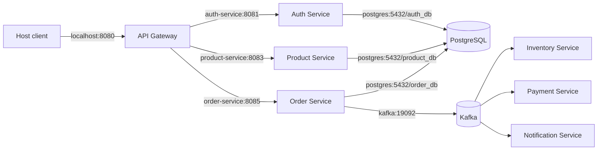

# 14 - Docker Compose and Service Networking

## What problem does Compose solve?

The application now has eight independently started Java processes, seven logical databases, a Kafka broker, durable volumes, health checks, and several internal URLs. Starting those pieces manually is slow and produces configuration drift. Docker Compose defines one repeatable local topology without turning the services back into a monolith.

Compose is a development and integration environment here. It is not a production scheduler and it does not provide self-healing across machines like Kubernetes.

## Monolith

A monolith usually starts as one process with one datasource. Method calls remain in memory, `localhost` often reaches every dependency, and one health endpoint can describe most of the application.

## Microservices

Every container has its own network namespace. Inside `order-service`, `localhost:8083` means Order's own container, not Product. Compose gives each service a DNS name on the `ecommerce-network`, so Order calls `http://product-service:8083` and messaging services call `kafka:19092`.



## Host ports and container ports

Port publishing is only needed when the host must reach a container. Service-to-service traffic uses container ports and DNS names directly.

| Caller | Address | Why |
| --- | --- | --- |
| Host/client to Gateway | `http://localhost:8080` | Published debug/public entry point |
| Order to Product | `http://product-service:8083` | Internal Compose DNS |
| Services to PostgreSQL | `postgres:5432/<owned_db>` | Internal database listener |
| Services to Kafka | `kafka:19092` | Broker advertises a reachable internal address |
| Host tools to Kafka | `localhost:9092` | Separate advertised host listener |

All published ports bind to `127.0.0.1`. Direct backend ports are convenient for local debugging, but production traffic must enter through the Gateway or a private network policy.

The JWT issuer remains the canonical host URL `http://localhost:8081`, while Gateway, User, and Order fetch keys through the internal JWKS URL `http://auth-service:8081/.well-known/jwks.json`. The issuer is a stable identity claim; the JWKS URI is a network route.

## One PostgreSQL container is not one shared database

Local Compose co-locates seven databases on one PostgreSQL server to save memory. Each service receives a different login and database. `PUBLIC CONNECT` is revoked from each service database, so one application credential cannot connect to another service's database.

The bootstrap script creates databases and roles only. Flyway inside each owning application creates and evolves its tables. This keeps schema ownership with the service.

Production can move a database to another cluster by changing only that service's JDBC URL and secret. No domain boundary or API contract changes.

## Kafka listeners and topics

Kafka advertises two addresses because the host and containers resolve different names:

- `INTERNAL://kafka:19092` for application containers.
- `HOST://localhost:9092` for local CLI tools.

Automatic topic creation is disabled. The one-shot `kafka-init` container creates the five versioned topics and matching DLTs with three partitions. Explicit topology catches misspelled topic names and makes partition assumptions visible.

## Health and startup ordering

Compose waits for PostgreSQL and Kafka health, then waits for topic creation before starting Kafka participants. Application Dockerfiles probe `/actuator/health/readiness`.

This only improves startup. If Product becomes unavailable after Order starts, Compose does not make the HTTP call reliable. Timeouts, retry policy, circuit breakers, idempotency, and observable failure states are runtime concerns covered by the next resilience milestone.

Readiness and liveness answer different questions:

- Readiness: can this instance safely receive traffic now?
- Liveness: is the process stuck and should a scheduler restart it?

## Local commands

```powershell
Copy-Item .env.example .env
docker compose up --build -d
docker compose ps
./scripts/verify-compose.ps1
docker compose logs -f order-service inventory-service payment-service notification-service
docker compose down
```

`docker compose down -v` also deletes Kafka and PostgreSQL data. Use it only when a full local reset is intentional.

## Failure lab

1. Start the stack and verify Gateway readiness.
2. Stop Product Service with `docker compose stop product-service`.
3. Attempt order creation and observe that Order cannot obtain an authoritative price snapshot.
4. Start Product again and observe recovery.
5. Explain why `depends_on` did not help after startup and which resilience rule should apply.

## Common mistakes

- Using `localhost` for container-to-container calls.
- Sharing the PostgreSQL superuser with applications.
- Treating startup ordering as runtime resilience.
- Relying on Kafka auto-topic creation.
- Exposing every backend port on all host interfaces.
- Committing `.env` or private JWT keys.
- Running `down -v` without understanding that named-volume data is deleted.

## Questions

1. Why can one PostgreSQL server still implement database-per-service?
2. Why does Kafka need separate advertised addresses for host and container clients?
3. What happens when a healthy dependency fails after startup?
4. Why does Flyway remain inside each service instead of the PostgreSQL bootstrap script?
5. Which ports are required for service-to-service traffic, and which are only debugging conveniences?

## Practical exercise

After the stack is healthy, inspect `docker compose ps` and draw the route for one order from host port `8080` to the internal DNS names. Then connect to PostgreSQL with `product_app` and verify that the same credential cannot connect to `order_db`.
