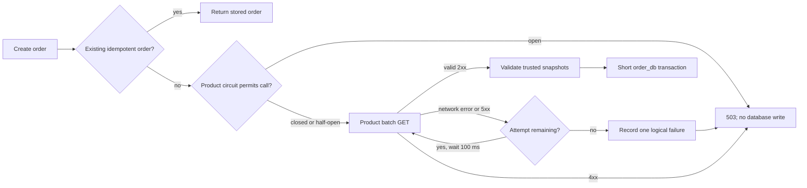

# 15 - Timeouts, Retries, and Circuit Breakers

## The concept

These three controls solve different parts of partial failure:

- A **timeout** limits how long one network attempt may occupy resources.
- A **retry** repeats a safe operation when a failure may be temporary.
- A **circuit breaker** stops calling a dependency that is repeatedly failing, then later permits a few probes to test recovery.

They are complementary. A retry without a timeout can wait forever; a timeout without a breaker lets every request keep stressing a failed dependency; a breaker without careful failure classification may open because of client mistakes rather than infrastructure failure.

## Why microservices need them

In a monolith, Order may call Product as an in-process method. The call normally returns or throws without DNS, TCP, serialization, remote thread pools, or an independently deployed process.

In microservices, Product can be healthy when Order starts and fail one second later. Compose `depends_on`, Kubernetes readiness, and service discovery help locate/start instances, but none can guarantee that a runtime call succeeds. The caller owns its behavior when the dependency is slow or unavailable.

## The implemented request flow



The circuit breaker is outside the retry. Therefore two failed HTTP attempts are one failed Order-to-Product operation in the breaker's sliding window. Counting every attempt would make retries open the breaker more aggressively than ordinary calls.

## Failure classification

| Outcome | Retry? | Breaker failure? | Reason |
| --- | --- | --- | --- |
| Connection/read failure | Yes, once | Yes after exhaustion | Often transient infrastructure failure |
| HTTP 5xx | Yes, once | Yes after exhaustion | Dependency did not complete normally |
| HTTP 4xx | No | No | Repeating the same request is deterministic |
| Circuit already open | No network call | Not permitted metric | Fail fast and protect both services |
| Valid response | No | Success | Continue to local transaction |

Only Product's batch `GET` receives this retry policy. A payment operation or an arbitrary `POST` must not be retried unless the remote side provides an idempotency contract. The Gateway also does not retry `POST /orders`; clients use the order idempotency key if their result is ambiguous.

## Circuit-breaker states

```text
CLOSED --failure threshold reached--> OPEN
OPEN --10 seconds, then next call--> HALF_OPEN
HALF_OPEN --probe succeeds--> CLOSED
HALF_OPEN --probe fails--> OPEN
```

`CLOSED` does not mean the dependency is guaranteed healthy; it means calls are currently allowed. `OPEN` is an intentional fast failure, not a process crash. `HALF_OPEN` limits test traffic so a recovering Product service is not immediately flooded.

The breaker state lives in each Order process. This avoids a new shared-state dependency, but replicas may open and recover at slightly different times. Metrics should therefore be aggregated across instances.

## Transaction boundary and fallback decision

Order performs the entire Product lookup before entering its write transaction. Waiting or sleeping for retry while holding a database connection would couple Product latency to Order's database capacity.

There is no fallback price. A stale cache could make the system appear available while accepting a commercially incorrect order. For this workflow, rejecting with a clear 503 is safer than fabricating authority. A future Product event-fed read model would be a separate architecture decision with explicit freshness rules.

## Tuning trade-offs

- More attempts improve the chance of recovering a brief fault but multiply downstream traffic and caller latency.
- A tiny breaker window reacts quickly but may open on noise; a large window reacts slowly during a real outage.
- A long open period protects Product but delays recovery; a short period sends more probes.
- Retrying immediately can synchronize many callers. This project uses one small fixed delay for clarity; higher-scale systems often add exponential backoff and jitter.

Configuration is externalized, validated, and capped at three attempts so a typo cannot silently create an extreme retry storm.

Timeouts also form a hierarchy. Gateway allows five seconds for a downstream response; Order's Product policy is bounded to roughly 4.1 seconds in the worst case: two attempts that may each consume 500 milliseconds connecting and 1.5 seconds reading, plus 100 milliseconds between attempts. An outer timeout shorter than its inner operation would turn Order's intended 503 into a Gateway 504 and hide the useful error contract.

## Failure lab

1. Start the Compose stack and run `./scripts/verify-compose.ps1` once.
2. Stop Product with `docker compose stop product-service`.
3. Submit several new order requests with different idempotency keys.
4. Observe initial bounded failures, then fast failures after the circuit opens.
5. Start Product with `docker compose start product-service`.
6. Wait for the open interval, submit probes, and observe recovery.
7. Confirm that failed attempts created neither an order nor an outbox row.

## Questions

1. Why is retrying Product's GET safer than retrying a non-idempotent payment POST?
2. Why does the breaker wrap the complete retry sequence in this design?
3. What would happen to Order's database pool if the HTTP call ran inside `@Transactional`?
4. When would a stale Product read model be an acceptable fallback, and what freshness contract would it require?
5. Why is a circuit breaker per Order instance preferable to storing its state in PostgreSQL?
