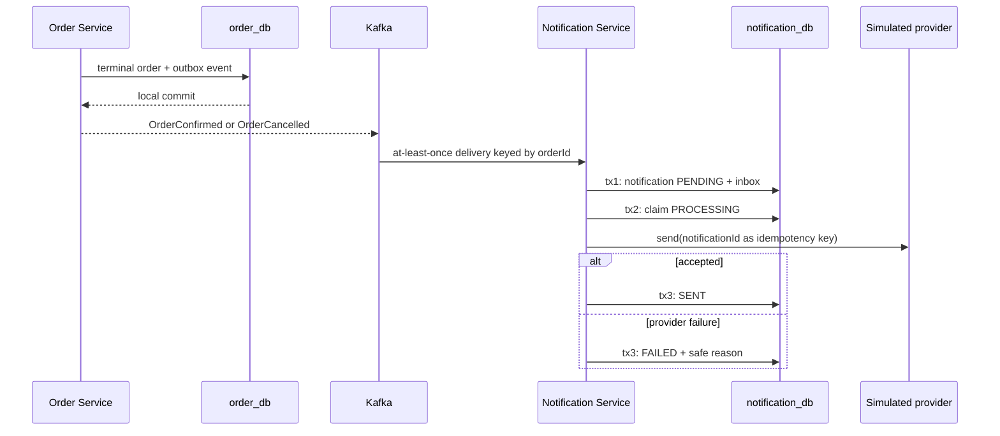

# Notification Service

Notification Service reacts to terminal Order outcomes without making order completion depend on a slow or unavailable delivery provider. It owns notification history and delivery state in `notification_db`; it does not decide whether an order is confirmed or cancelled.

## Why this boundary exists

In a monolith, code often sends an email immediately after changing the order row. That makes response time and transaction success depend on an external provider. In this microservice architecture, Order commits its terminal state plus an outbox event first. Notification consumes that fact later, so provider failure cannot roll back a valid order.

The service listens to `OrderConfirmed` and `OrderCancelled`, not `PaymentCompleted`. Payment success is only one participant outcome; Order owns the customer-visible state machine and is the authoritative source of the final business result.

## Responsibilities

- Validate versioned terminal Order event envelopes and Kafka keys.
- Persist one system notification per order.
- Record processed event IDs for at-least-once Kafka delivery.
- Suppress exact and semantic duplicates.
- Simulate delivery through a replaceable provider boundary.
- Persist `PENDING`, `PROCESSING`, `SENT`, and `FAILED` delivery states.
- Route invalid or contradictory events to `order.events.v1.DLT` after the configured error policy.

It does not own orders, payments, inventory, customer credentials, or verified email addresses. The first channel is `SYSTEM` because the event carries an opaque `customerId`, not an email address. A future email adapter needs an explicit privacy-aware recipient contract or local projection; it should not add an unbounded synchronous User Service lookup to every delivery.

## Event flow



The provider call is outside a database transaction. This avoids holding a connection and row lock while external latency is uncontrolled. The durable notification ID is the provider idempotency key for a future real adapter.

## Idempotency and delivery semantics

Kafka delivery is at least once, not exactly once:

- `processed_events.event_id` suppresses exact redelivery.
- `UNIQUE(order_id, channel)` suppresses a semantically duplicate terminal event with a new event ID.
- A contradictory confirmed/cancelled pair is rejected instead of silently changing notification meaning.
- Re-delivery after a crash can resume a non-`SENT` notification.
- A real provider must honor `notificationId` as an idempotency key because a crash after provider acceptance but before the `SENT` commit can cause another send attempt.

The inbox and `PENDING` notification share one transaction. Provider delivery deliberately uses later transactions because PostgreSQL cannot atomically commit an external side effect. A scheduled retry/recovery worker for `FAILED` or abandoned `PROCESSING` rows is deferred to the resilience milestone; failure state is already durable and indexed for it.

## Database

Flyway migration `V1__create_notification_schema.sql` creates:

- `notifications`: source event, order/customer references, type, channel, content, state, attempts, correlation ID and timestamps.
- `processed_events`: consumer inbox keyed by globally unique event ID.
- Unique constraints for exact and semantic idempotency.
- State/content/correlation checks and indexes for customer history and retry scans.

Order and customer IDs are opaque cross-service references. There are no cross-database foreign keys or shared JPA entities.

## Configuration

| Variable | Purpose | Default |
| --- | --- | --- |
| `SERVER_PORT` | Actuator HTTP port | `8087` |
| `NOTIFICATION_DB_URL` | Notification PostgreSQL JDBC URL | `jdbc:postgresql://localhost:5432/notification_db` |
| `NOTIFICATION_DB_USERNAME` | Database user | `notification_app` |
| `NOTIFICATION_DB_PASSWORD` | Database password | Required; no default |
| `KAFKA_BOOTSTRAP_SERVERS` | Kafka brokers | `localhost:9092` |
| `KAFKA_CONSUMER_MAX_RETRIES` | Retries after the initial delivery attempt | `3` |
| `KAFKA_CONSUMER_RETRY_INITIAL_INTERVAL` | First transient-failure backoff | `PT0.25S` |
| `KAFKA_CONSUMER_RETRY_MULTIPLIER` | Exponential retry multiplier | `2.0` |
| `KAFKA_CONSUMER_RETRY_MAX_INTERVAL` | Maximum retry interval | `PT2S` |
| `KAFKA_DLT_PUBLISH_TIMEOUT` | Broker acknowledgement timeout for DLT publication | `PT5S` |
| `NOTIFICATION_KAFKA_CONSUMER_GROUP` | Independent consumer group | `notification-service-v1` |
| `ORDER_EVENTS_TOPIC` | Terminal order topic | `order.events.v1` |
| `NOTIFICATION_MESSAGING_LISTENER_ENABLED` | Start Kafka listener | `true` |
| `NOTIFICATION_SIMULATOR_FAIL_DELIVERIES` | Persist deterministic provider failures | `false` |

## Run and verify

Start PostgreSQL and Kafka, set `NOTIFICATION_DB_PASSWORD`, then:

```powershell
.\mvnw.cmd -pl services/notification-service spring-boot:run
```

Readiness is `http://localhost:8087/actuator/health/readiness`. There is intentionally no public business API in this milestone.

```powershell
.\mvnw.cmd -pl services/notification-service test
docker build -f services/notification-service/Dockerfile -t ecommerce/notification-service:local .
```

The suite has 18 tests covering domain transitions, strict parsing, Flyway/JPA behavior, provider failure, contradictory or corrupted events, exact/semantic duplicates, and real Kafka/PostgreSQL success and DLT flows.
